```{r setup, include=FALSE}
knitr::opts_chunk$set(echo = FALSE)
```

## Outline

-   Introduction to R graphics

-   ggplot2 package

-   Data Visualization with ggplot2

-   Graphics for Communication

## Introduction to R graphics

### **four graphic systems in R**

1.  basic graphics
2.  lattice package
3.  ggplot2 package
4.  grid package

## ggplot2 package

### **What is ggplot2?**

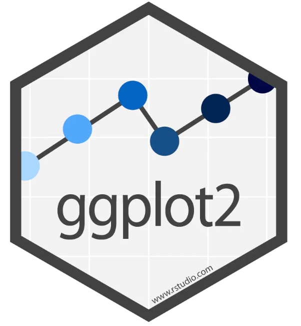{width="185"}

ggplot2 is an R package for producing statistical, or data, graphics, and it's one of the core members of the tidyverse.

Unlike most other graphics packages, ggplot2 has an underlying grammar, based on the Grammar of Graphics, that allows you to compose graphs by combining independent components.

## **General steps of using ggplot2**

1.  Prepare the data, usually as a data frame.

2.  Enter the data into the ggplot( ) function and specify which graphical properties each variable involved in the graph is mapped to, such as x-coordinates, y-coordinates, colors, shapes, etc.

3.  Select a suitable graph type where the function name begins with geom\_, such as geom_point( ) represents a scatter plot. The graphic type is abbreviated as geom. Connect the ggplot( ) part with the geom_xxx( ) part with a plus sign.

4.  Set the appropriate coordinate system, such as coord_cartesian( ), scale_x\_log10( ), etc. Still connect with a plus sign.

5.  Set the title and legend position, etc., such as labs( ). Still connect with a plus sign.

## **The Layered Grammar of Graphics**

ggplot2 implements the grammar of graphics, which decomposes a graph task into several subtasks, and as long as each subtask is completed, the graph can be completed.

**Plot = Data + Aesthetics + Geometry**

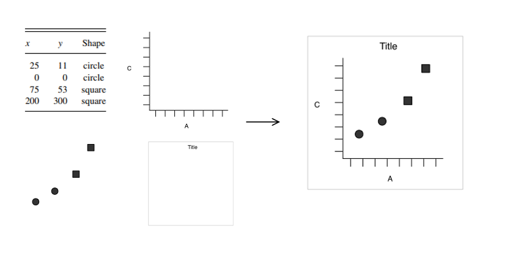{width="515"}

ggplot ( data = \<data_frame\>,

mapping = aes( \<dimension\> = \<var_name\>,

\<dimension\> = \<var_name\> ), \<...\>) +

geom\_\<graph_type\> ( \<...\> ) +

scale\_\<mapping\>\_\<type\> ( \<...\> ) +

coord\_\<type\> ( \<...\> ) +

labs ( \<...\> )

## Basic scatter plot

-   **diffierent ways of install ggplot2 package**

<!-- -->

    #直接安装tidyverse包
    install.packages("tidyverse")
    #直接安装ggplot2
    install.packages("ggplot2")
    #从Github上安装最新的版本，先安装devtools(如果没安装的话)
    devtools::install_github("tidyverse/ggplot2")

-   **scatter plots based on mpg data frames**

```{r student-plot1, echo=TRUE}
    library(ggplot2) #library(tidyverse)
    ggplot()+
      geom_point(data = mpg,
                 mapping = aes(x = displ,y = hwy))
```

## Aesthetic Mappings

### **Add an additional variable**

**color**

```{r student-plot2, echo=TRUE}
    ggplot()+
      geom_point(data = mpg,
                 mapping = aes(x = displ,y = hwy, color = class))
```

## shape

```{r student-plot3, echo=TRUE}
    ggplot()+
      geom_point(data = mpg,
                 mapping = aes(x = displ,y = hwy, shape = class))
```

## transparency

```{r student-plot3.2, echo=TRUE}
    ggplot()+
      geom_point(data = mpg,
                 mapping = aes(x = displ,y = hwy, alpha = class))
```

## **Programming considerations**

-   **Plus sign**

    ggplot(data = mpg)

    [+]{style="color:red"} geom_point(mapping = aes(x = displ, y = hwy))

-   **color option**

```{r student-plot4, echo=TRUE}
    ggplot()+
      geom_point(data = mpg,
                 mapping = aes(x = displ,y = hwy, color = "blue"))
    ggplot()+
      geom_point(data = mpg,
                 mapping = aes(x = displ,y = hwy), color = "blue")

```

## Facets

**facet_wrap**

facet the plot by a single variable, using \~sign

```{r student-plot5, echo=TRUE}
    ggplot()+
      geom_point(data = mpg,
                 mapping = aes(x = displ,y = hwy))+
                 facet_wrap(~class)

```

scale = "fixed"/ "free"/ "free_x"/ "free_y"

nrow / ncol = n

```{r student-plot6, echo=TRUE}
    ggplot()+
      geom_point(data = mpg,
                 mapping = aes(x = displ,y = hwy))+
                 facet_wrap(~class, scale = "free_x",nrow = 4)

```

## **facet_grid**

facet the plot by two variables, using \~ sign to connect (row\~col)

use . sign to replace (. \~ class)

```{r student-plot7, echo=TRUE}
    ggplot()+
      geom_point(data = mpg,
                 mapping = aes(x = displ,y = hwy))+
                 facet_grid(drv~cyl,margins=TRUE)

```

## Geometric Objects

Geometric objects represent the graphic elements we actually see in the diagram, such as points, lines, polygons, and so on.

```{r student-plot8.1, echo=TRUE}
    ggplot()+
      geom_smooth(data = mpg,
                 mapping = aes(x = displ,y = hwy))
```

## Histogram

```{r student-plot8.2, echo=TRUE}
data(diamonds)
set.seed(1234)
diamond <- diamonds[sample(nrow(diamonds), 2000), ]
head(diamond)

ggplot()+
      geom_histogram(data = diamond,
                 mapping = aes(x = price))
```

## Bar plot

```{r student-plot8.3, echo=TRUE}
    ggplot()+
      geom_bar(data = diamond,
                 mapping = aes(x = clarity))  
```

## Box plot

```{r student-plot8.4, echo=TRUE}
    ggplot()+
      geom_boxplot(data = diamond,
                 mapping = aes(x=cut, y=price)) 

```

## geom\_

    ggplot2::geom_

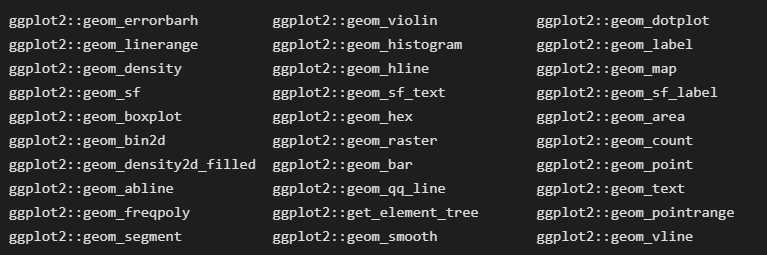

## Statistical Transformations

    ggplot(data = diamonds) +
    geom_bar(mapping = aes(x = cut))

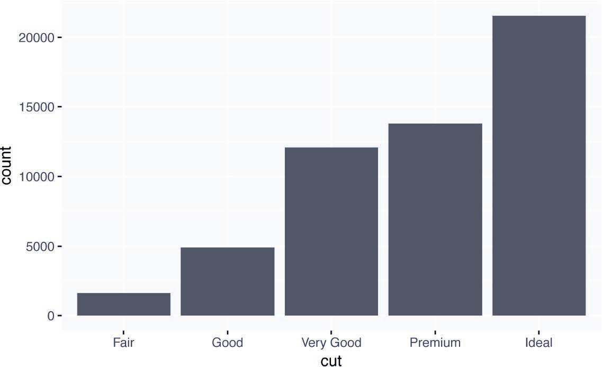{width="547"}

## Statistical Transformations

-   Bar charts, histograms, and frequency polygons bin your data and then plot bin counts, the number of points that fall in each bin.

-   Smoothers fit a model to your data and then plot predictions from the model.

-   Boxplots compute a robust summary of the distribution and display a specially formatted box.

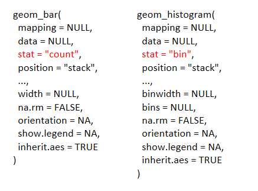

## Statistical Transformations

You can generally use geoms and stats interchangeably. For example, you can re-create the previous plot using stat_count() instead of geom_bar():

    ggplot(data = diamonds) +
    stat_count(mapping = aes(x = cut))

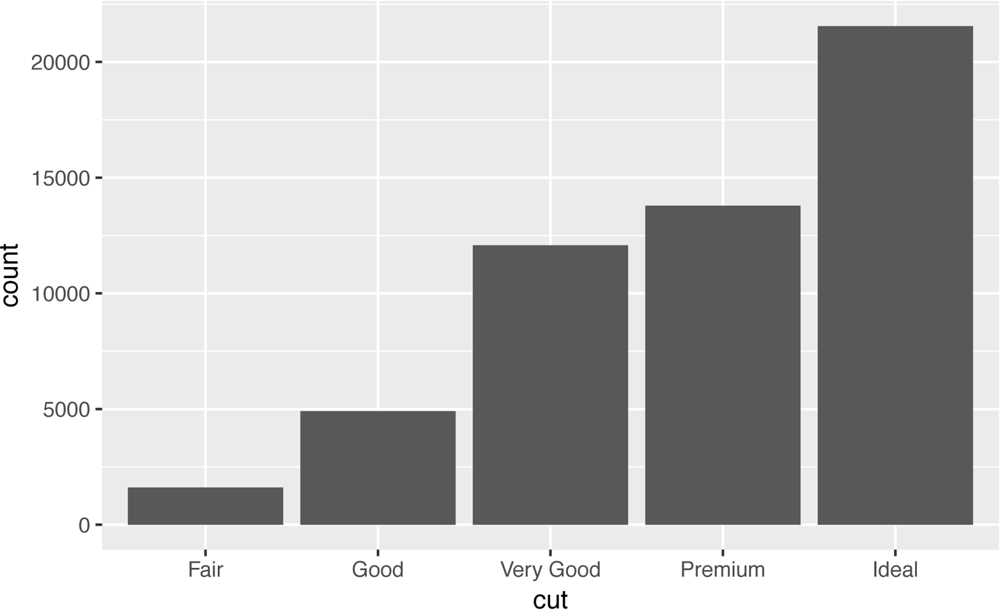{width="539"}

## stat_summary

```{r student-plot15.1, echo=TRUE}

ggplot(data = diamonds) +
stat_summary(
mapping = aes(x = cut, y = depth),
fun.min = min,
fun.max = max,
fun = median
)
```

## stat_smooth

```{r student-plot15.2, echo=TRUE}
ggplot(mpg, aes(displ, hwy)) +
geom_point() +
stat_smooth(method = lm, formula = y ~ splines::bs(x, 3), se = FALSE)
```

## Position Adjustments

### fill

    #Fill colors by cut classification
    ggplot() +
    geom_bar(data = diamonds, mapping = aes(x = cut, fill = cut))
    #fill colors by clarity classification
    ggplot() +
    geom_bar(data = diamonds, mapping = aes(x = cut, fill = clarity))

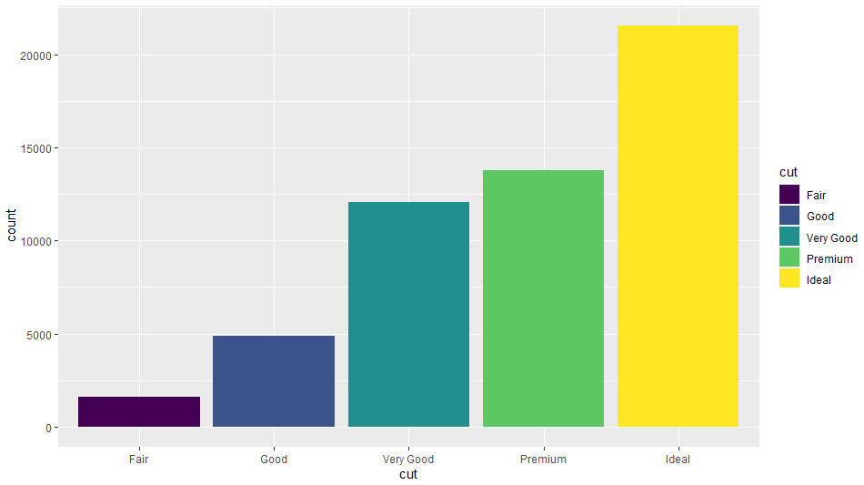{width="597"}

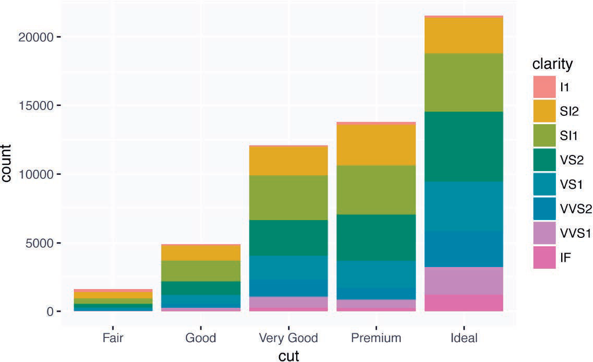{width="606"}

## position

### identity

    ggplot(data = diamonds, mapping = aes(x = cut, fill = clarity)) +
    geom_bar(alpha = 1/5, position = "identity")

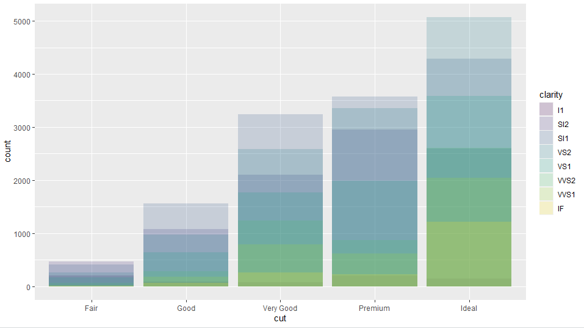{width="614"}

    ggplot(data = diamonds, mapping = aes(x = cut, color = clarity)) +
        geom_bar(fill = NA, position = "identity")

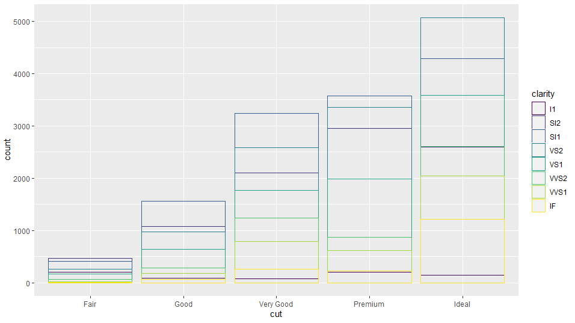{width="622"}

## fill

    ggplot(data = diamonds) +
        geom_bar(mapping = aes(x = cut, fill = clarity), position = "fill")

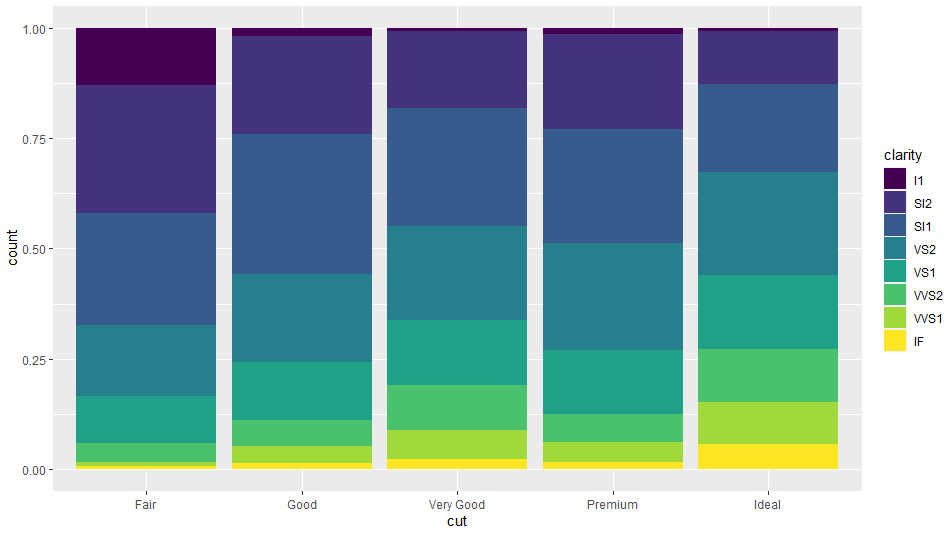{width="623"}

## dodge

    ggplot(data = diamonds) +
        geom_bar(mapping = aes(x = cut, fill = clarity), position = "dodge")

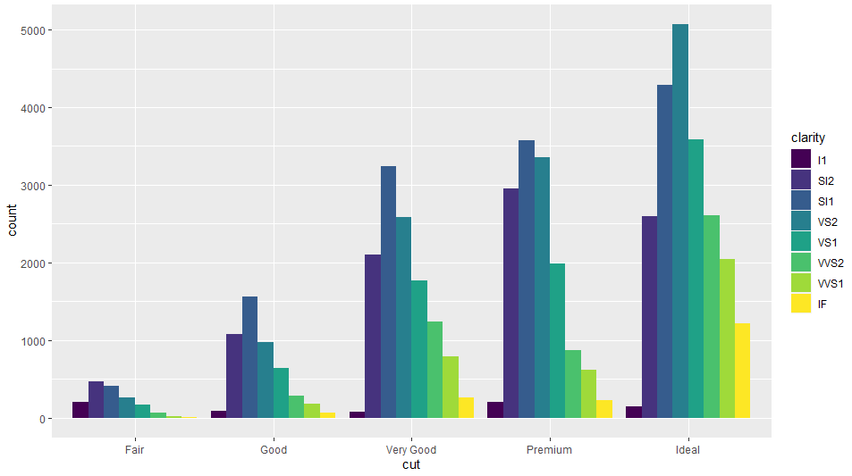{width="619"}

## Coordinate Systems

### Axes

coord_flip() switches the x- and y-axes.

    ggplot(data = mpg, mapping = aes(x = class, y = hwy)) +
    geom_boxplot() 

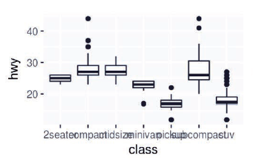{width="522"}

    ggplot(data = mpg, mapping = aes(x = class, y = hwy)) +
    geom_boxplot()+
    coord_flip()

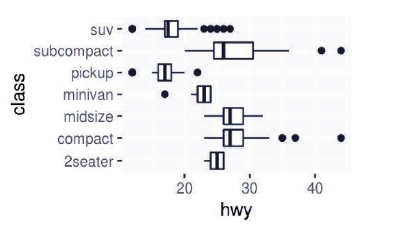{width="530"}

## Maps

coord_quickmap() sets the aspect ratio correctly for maps.

    nz <- map_data("nz")
    ggplot(nz, aes(long, lat, group = group)) +
    geom_polygon(fill = "white", color = "black")
    ggplot(nz, aes(long, lat, group = group)) +
    geom_polygon(fill = "white", color = "black") +
    coord_quickmap()

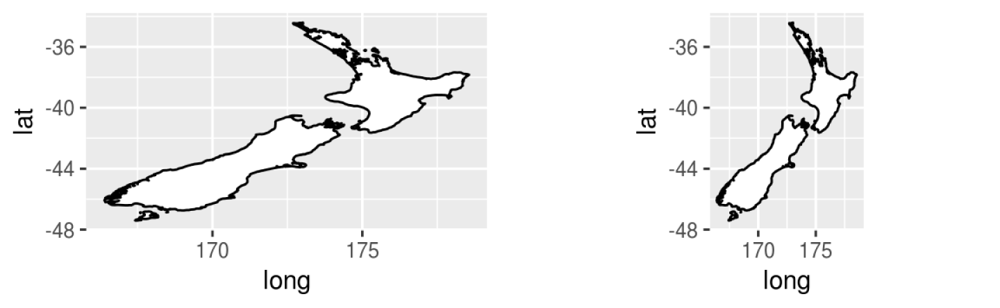{width="598"}

## Polar

coord_polar() uses polar coordinates.

    bar <- ggplot(data = diamonds) +
    geom_bar(
    mapping = aes(x = cut, fill = cut),
    show.legend = FALSE,
    width = 1
    ) +
    theme(aspect.ratio = 1) +
    labs(x = NULL, y = NULL)
    bar + coord_flip()
    bar + coord_polar()

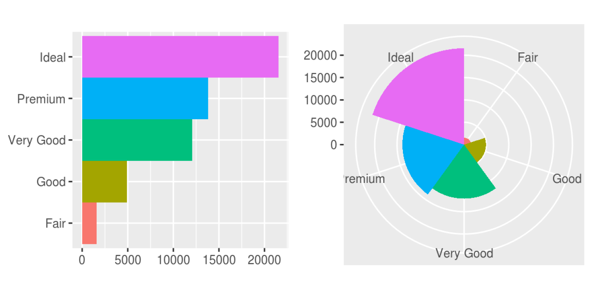{width="595"}

## Graphics for Communication with ggplot2

To help others quickly build up a good mental model of the data, you will need to invest considerable effort in making your plots as self-explanatory as possible.

### Label

-   The easiest place to start when turning an exploratory graphic into an expository graphic is with good labels.

```{r student-plot12, echo=TRUE}
ggplot(mpg, aes(displ, hwy)) +
  geom_point(aes(color = class)) +
  geom_smooth(se = FALSE) +
  labs(
    tag = "Scatter Plot and Smooth Curve",
    title = "Fuel efficiency generally decreases with engine size",
    subtitle = "Two seaters (sports cars) are an exception because of their light weight",
    caption = "Data from fueleconomy.gov"
  )

```

## mathematical equations

-   Use mathematical equations instead of text strings.

<!-- -->

    ggplot(mpg, aes(displ, hwy)) +
    geom_point(aes(color = class)) +
    geom_smooth(se = FALSE) +
    labs(
    x = "Engine displacement (L)",
    y = "Highway fuel economy (mpg)",
    colour = "Car type"
    )

    df <- tibble(
    x = runif(10),
    y = runif(10)
    )
    ggplot(df, aes(x, y)) +
    geom_point() +
    labs(
    x = quote(sum(x[i] ^ 2, i == 1, n)),
    y = quote(alpha + beta + frac(delta, theta))
    )

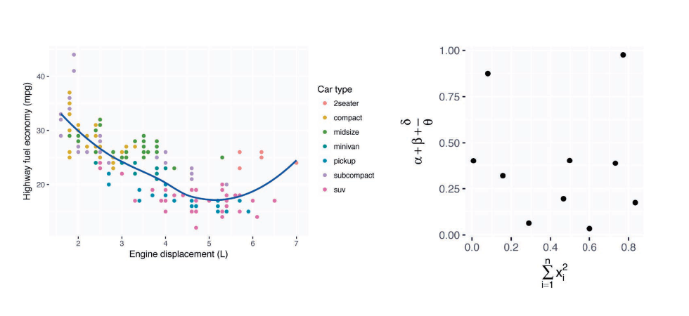{width="736"}

## Scale

Adjust the scales is another way to make a plot better for communication.

Normally, ggplot2 adds scales automatically. For example:

    ggplot(mpg, aes(displ, hwy)) +
    geom_point(aes(color = class))

ggplot2 automatically adds default scales behind the scenes:

    ggplot(mpg, aes(displ, hwy)) +
    geom_point(aes(color = class)) +
    scale_x_continuous() +
    scale_y_continuous() +
    scale_color_discrete()

## Axis Ticks and Legend Keys

There are two primary arguments that affect the appearance of the ticks on the axes and the keys on the legend: breaks and labels.

Breaks controls the position of the ticks, or the values associatedwith the keys. Labels controls the text label associated with each tick/key.

    #Breaks
    ggplot(mpg, aes(displ, hwy)) +
    geom_point() +
    scale_y_continuous(breaks = seq(15, 40, by = 5))

    #labels
    ggplot(mpg, aes(displ, hwy)) +
    geom_point() +
    scale_x_continuous(labels = NULL) +
    scale_y_continuous(labels = NULL)

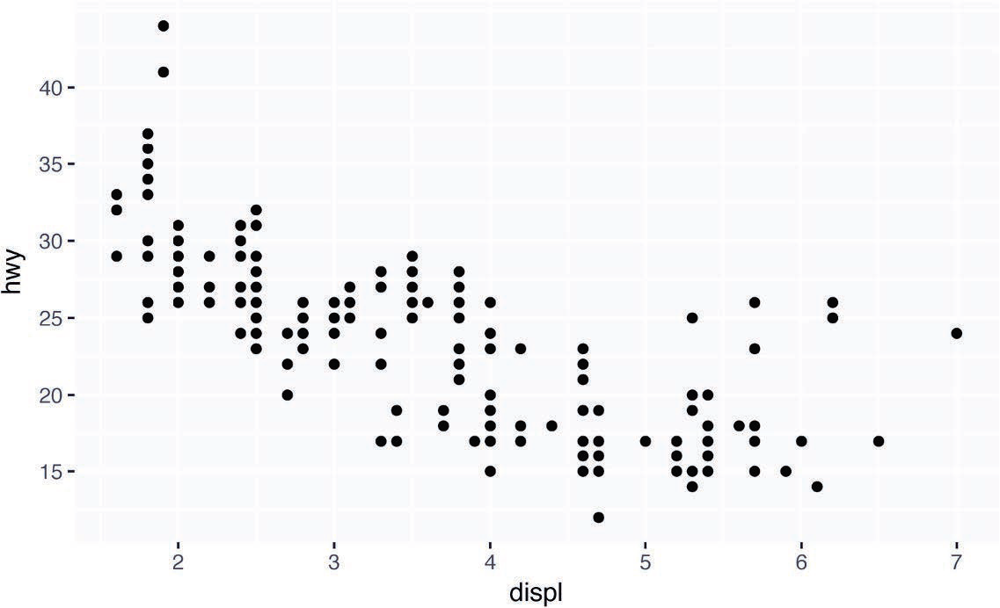{width="546"}

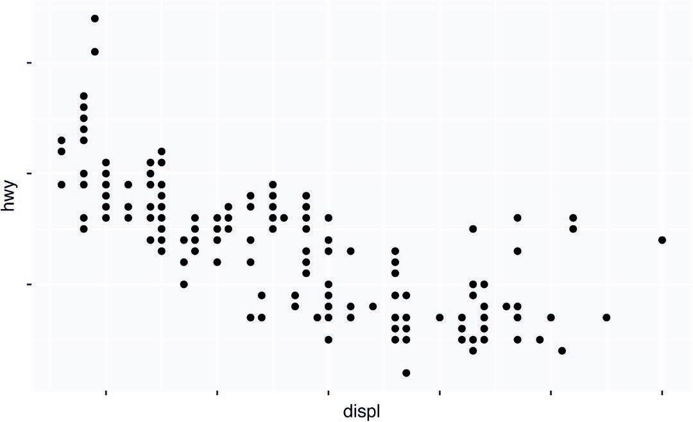{width="555"}

## Replacing a Scale

Instead of just tweaking the details a little, you can replace the scale altogether.

    #初始图像
    ggplot(diamonds, aes(carat, price)) +
      geom_bin2d()
    ggplot(diamonds, aes(log10(carat), log10(price))) +
      geom_bin2d()
      

    #使用标度进行对数转换
    ggplot(diamonds, aes(carat, price)) +
      geom_bin2d() +
      scale_x_log10() +
      scale_y_log10()

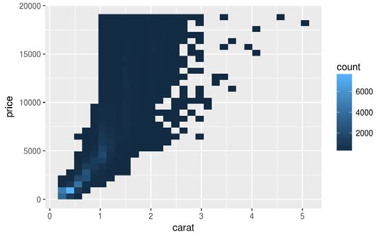{width="564"}

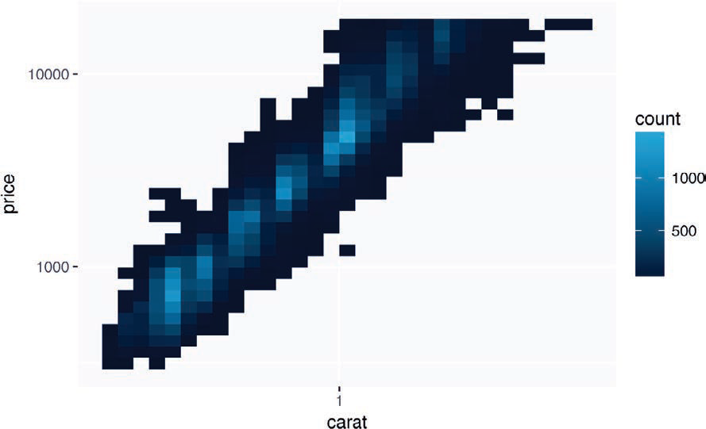{width="549"}

## scale_color_brewer

    ggplot(mpg, aes(displ, hwy)) +
    geom_point(aes(color = drv))

    ggplot(mpg, aes(displ, hwy)) +
    geom_point(aes(color = drv)) +
    scale_color_brewer(palette = "Set1")

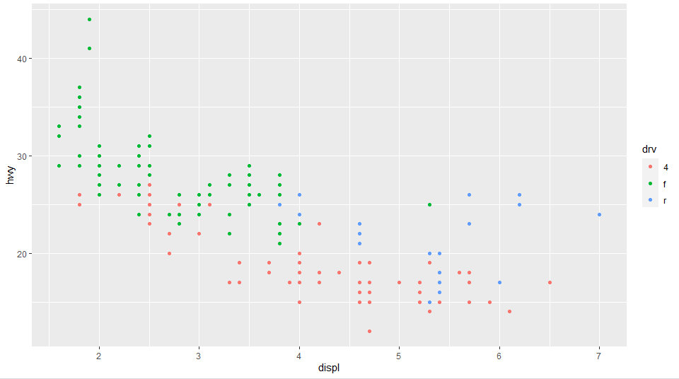{width="539"}

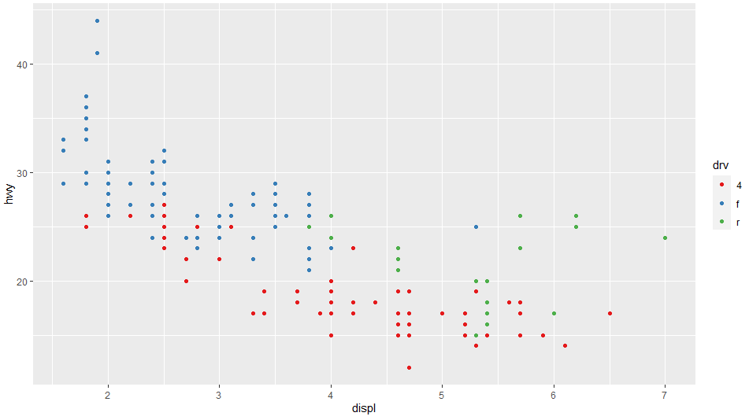{width="555"}

Other palettes

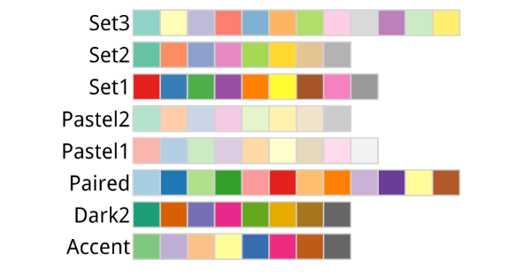{width="464"}

## Theme

Finally, we can customize the nondata elements of your plot with a theme.

```{r student-plot13, echo=TRUE}
ggplot(mpg, aes(displ, hwy)) +
geom_point(aes(color = class)) +
geom_smooth(se = FALSE) +
theme_bw()
```

## Eight themes

ggplot2 includes eight themes by default. Many more are included in add-on packages like ggthemes, by Jeffrey Arnold.

theme(legend.position) can be used to select the legend position. theme_set() can change the theme (color scheme, font, etc.) of subsequent ggplot2 drawings. Such as theme_set (theme_bw ()), theme_set (theme_dark ()) and so on. For a single drawing, you can directly connect these theme functions such as theme_gray() with a plus sign. Topics include theme_gray() (default theme), theme_minimal(), theme_classic(), and so on.

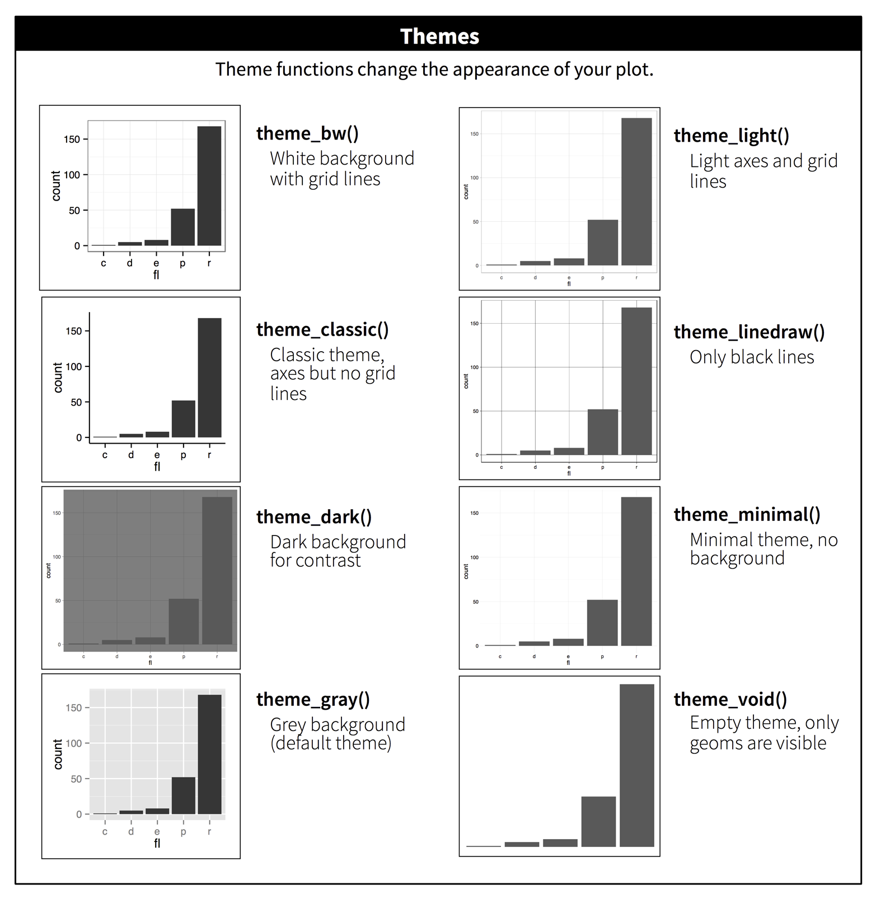{width="453"}

## Legend Layout

Legend is automatically generated while using color or shape to classify variables.

Use a method like guides(color = FALSE) to undo the legend for the specified dimension.

Changing the position of the legend with legend.position of theme( ), such as using theme(legend.position = "top") to place the legendon top, the default if placed on the right. "none", "left", "right", "bottom" are also can be taken.

    base <- ggplot(mpg, aes(displ, hwy)) +
    geom_point(aes(color = class))
    base + theme(legend.position = "left")
    base + theme(legend.position = "top")
    base + theme(legend.position = "bottom")
    base + theme(legend.position = "right")

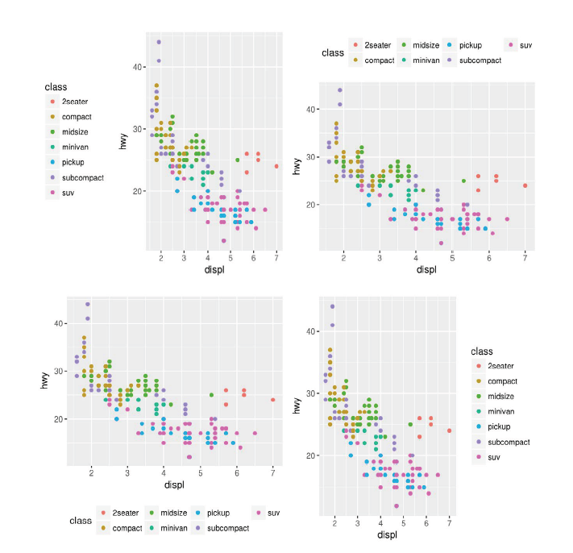{width="538"}

## Save plots

ggsave is a convenient function for saving a plot. It defaults to saving the last plot that you displayed, using the size of the current graphics device. It also guesses the type of graphics device from the extension.

    ggplot(mpg, aes(displ, hwy)) + geom_point()
    ggsave("my-plot.pdf")

{width="331"}

## Learning More

[《R Graphics Cookbook, 2nd edition》](https://r-graphics.org/)

[《ggplot2: Elegant Graphics for Data Analysis》](https://ggplot2-book.org/introduction.html)
