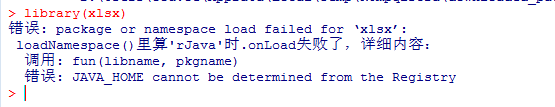

```{r setup, include=FALSE}
knitr::opts_chunk$set(echo = FALSE)
```

# Outline

-   Data Import with readr

-   Tibbles with tibble

-   Data Transformation with dplyr

    

# Readr

main package: library(**tidyverse**)

-   read_csv() --\> comma-delimited files

-   read_csv2() --\> semicolon-separated files

-   read_tsv() --\> tab-delimited files

-   read_delim() --\>any delimiter files

    \

-   read_fwf() --\>fixed-width files

-   read_table() --\>fixed-width files, separated by white space

    \

-   read_log() --\>Apache style log files(need package: webreadr)

# read_csv usage

-   read_csv(

    file,

    col_names = TRUE,

    col_types = NULL,

    col_select = NULL,

    id = NULL,

    locale = default_locale(),

    na = c("", "NA"),

    quoted_na = TRUE,

    quote = "\\"",

    comment = "",

    trim_ws = TRUE,

    skip = 0,

    n_max = Inf,

    guess_max = min(1000, n_max),

    name_repair = "unique",

    num_threads = readr_threads(),

    progress = show_progress(),

    show_col_types = should_show_types(),

    skip_empty_rows = TRUE,

    lazy = should_read_lazy()

    )

# Some example for read_csv

```{r message=FALSE, warning=FALSE}
library(tidyverse)
```

```{r echo=T,eval=F}
library(readr)
#can use setwd() to fix default path
lbtest <- read_csv("lbtest.csv")
```

```{r echo=T,eval=F}
lbtest <- read_csv("D:/Users/You.Ye/OneDrive - FMD K&L Inc/Documents/share/R_practise/data/lbtest.csv")
```

-   use inline CSV file
-   The first line will set into column name in default

```{r echo=TRUE}
read_csv("a,b,c
1,2,3
4,5,6")

read_csv("
1,2,3
4,5,6")
```

-   use skip = n to skip the first n lines

```{r echo=TRUE}
read_csv("The first line of metadata
The second line of metadata
x,y,z
1,2,3", skip = 2)
```

-   use comment = "#" to drop all lines that start with (e.g.) #:

```{r echo=TRUE}
read_csv("# A comment I want to skip
x,y,z
1,2,3", comment = "#")

```

-   use col_names= FALSE, set column names sequentially from X1 to Xn
-   "\\n" is a convenient shortcut for adding a new line

```{r echo=TRUE}
read_csv("1,2,3\n4,5,6", col_names = FALSE)
```

-   specifies missing values

```{r echo=TRUE}
read_csv("a,b,c\n1,2,.", na = ".")
read_csv("a,b,c\n1,2,.")
```

# Parsing a Vector: parse\_\*() functions

-   parse\_\*(): These functions take a character vector and return a more specialized vector like a logical, integer, or date.

-   **str(object, ...):** Compactly display the internal structure of an R object, a diagnostic function and an alternative to summary

-   parse_logical()

-   parse_integer()

-   parse_double()

-   parse_number()

-   parse_character()

-   parse_factor()

-   parse_datetime()

-   parse_date()

-   parse_time()

    \

-   logical: T /F /TRUE /FALSE /NA /0 /1

```{r echo=TRUE}
str(parse_logical(c("TRUE", "FALSE", "NA","T","F","1","0")))
```

-   If parsing fails, the failures will be missing in the output

```{r echo=TRUE}
str(parse_date(c("TRUE", "FALSE", "NA")))
```

-   The na argument can specifies which strings should be treated as missing

```{r echo=TRUE}
str(parse_integer(c("1", "2", "3")))
parse_integer(c("1", "231", ".", "456"))
parse_integer(c("1", "231", ".", "456"), na = ".")
```

```{r echo=TRUE}
str(parse_date(c("2010-01-01", "1979/10/14")))
```

# Numbers

-   Parse 1,000,000/1.45/it cost \$10 to num
-   The default decimal mark is ".", decimal_mark argument can override the default value of .

```{r echo=TRUE}
parse_number("123,456789",locale = locale(decimal_mark = ","))
```

-   grouping_mark define the symbol separated the number

```{r echo=TRUE}
parse_number("123.456.789",locale = locale(grouping_mark = "."))
```

-   grouping_mark and decimal_mark can not use the same symbol

```{r echo=TRUE}
parse_number("1.234,56", locale = locale(decimal_mark = ".", grouping_mark = ","))
```

-   It ignores non numeric characters before and after the number
-   If multiple numbers in one string, extract the first number

```{r echo=TRUE}
parse_number("it cost $10")
parse_number("it cost $1$0 $100")
```

# Strings

-   parse_character() should be really simple---it could just return its input
-   locale(encoding= ): specify the encoding in parse_character(): when the print results are gibberish

```{r echo=TRUE}
parse_character('Hello 567')
parse_character("Hello 世界",locale=locale(encoding="GBK"))
parse_character("Hello 世界",locale=locale(encoding="UTF-8"))
```

-   charToRaw(): return the ASCII

```{r echo=TRUE}
charToRaw("Hello 世界")
guess_encoding(charToRaw("Hello 世界"))
parse_character("Hello 世界",locale=locale(encoding="ISO-8859-7"))
parse_character("Hello 世界",locale=locale(encoding="UTF-8"))

```

# Factors

-   R uses factors to represent categorical variables that have a known set of possible values.

```{r echo=TRUE}
fruit <- c("apple", "banana","pineapple")
parse_factor(c("apple", "banana", "bananana"), levels = fruit)
parse_factor(c("apple", "banana"), levels = fruit)
```

# Dates, Date-Times, and Times

-   The first day in SAS system: 1960-01-01

-   The first day in R system: 1970-01-01

-   parse_datetime() expects an ISO8601 date-time

-   parse_date() expects a four-digit year, a - or /, the month, a - or /, then the day

-   parse_time() expects the hour, :, minutes, optionally : and seconds, and an optional a.m./p.m. specifier

-   User-defined formats can also be recognized, if built up of the following pieces:

-   

          Year
              %Y (4 digits). 
              %y (2 digits; 00-69 → 2000-2069, 70-99 → 1970-1999). 

-   

          Month
              %m (2 digits). 
              %b (abbreviated name, like "Jan"). 
              %B (full name, "January"). 

-   

          Day
              %d (2 digits). 
              %e (optional leading space).

-   

          Time 
              %H (0-23 hour format). 
              %I (0-12, must be used with %p). 
              %p (a.m./p.m. indicator). 
              %M (minutes). 
              %S (integer seconds). 
              %OS (real seconds).
              %Z (time zone [a name, e.g., America/Chicago]). 
              %z (as offset from UTC, e.g., +0800).

-   

          Nondigits 
              %. (skips one nondigit character). 
              %\* (skips any number of nondigits).

-   If you're using %b or %B with non-English month names, you'll need to set the lang argument to locale().

-   See the list of built-in languages in date_names_langs().

```{r echo=TRUE}
parse_datetime("2010-10-01T2010")
parse_datetime("20101010")
parse_date("2010/10-01")
parse_time("01:10 pm")
parse_date("220101",locale=locale(date_format = "%y%m%e"))
au_locale <- locale(date_format = "%d/%m/%Y")
parse_date("02/01/2006", locale = au_locale)
parse_date("1 janvier 2015", "%d %B %Y", locale = locale("fr"))
```

# Parsing a File

-   Reads the first 1000 rows

-   guess_parser(): returns readr's best guess

-   parse_guess(): guess to parse the column

-   The heuristic tries each of the following types, stopping when it finds a match:

-   

          logical
            Contains only “F”, “T”, “FALSE”, or “TRUE”.

-   

          integer
            Contains only numeric characters (and -).

-   

          double
            Contains only valid doubles (including numbers like 4.5e-5).

-   

          number
            Contains valid doubles with the grouping mark inside.

-   

          time
            Matches the default time_format.

-   

          date
            Matches the default date_format.

-   

          date-time
            Any ISO8601 date.

-   

          strings  

-   tail(x, ...)/head(x, ...): Returns the first or last parts of a vector, matrix, table, data frame or function.

-   guess_max = 1000+

-   col_types = cols(.default = col_character()+type_convert()

```{r echo=TRUE, eval=F}
challenge <- read_csv(readr_example("challenge.csv"))
problems(challenge)

```


-   It's highly recommend always supplying col_types, building up from the printout provided by readr

```{r echo=TRUE, eval=F}
challenge <- read_csv(
readr_example("challenge.csv"),
col_types = cols(
x = col_double(),
y = col_date()
)
)

```

-   type_convert(): If the data type is unknown first, can set data type to character, then use it to see the most likely data type

```{r echo=TRUE, eval=T}

challenge2 <- read_csv(readr_example("challenge.csv"),
col_types = cols(.default = col_character())
)

challenge2
type_convert(challenge2)

```

# Writing to a File

-   some important write\_\* function: write_csv()/write_tsv()/write_excel_csv()

-   Simple but will lose type information

```{r echo=TRUE,eval=F}
write_csv(challenge, "challenge.csv")
```

-   Store data in R's custom binary format called RDS

```{r echo=TRUE,eval=F}
write_rds(challenge, "challenge.rds")
read_rds("challenge.rds")

library(feather)
write_feather(challenge, "challenge.feather")
read_feather("challenge.feather")
```

# Other Types of Data

-   **haven** reads SPSS, Stata, and SAS files
-   **foreign** reads SPSS, Stata, and SAS files
-   **readxl** reads Excel files (both .xls and .xlsx).

## readxl

```{r echo=TRUE, eval=F}
#install.packages("readxl")
library("readxl")
#?read_excel
lbtest<-read_excel("LBTEST.xlsx")
lbtest<-read_xlsx("LBTEST.xlsx")
```



-   <https://blog.csdn.net/wqdwin/article/details/75386673>

## haven

-   haven read_sas() can keep label

```{r echo=TRUE,eval=F}
#install.packages('haven')
library("haven")
adsl<-read_sas("adsl.sas7bdat")
write_sas(adsl,"adsl2.sas7bdat")
```

## sas7bdat

```{r echo=TRUE,eval=F}
#read.sas7bdat() will lose label 
#install.packages("sas7bdat")
library("sas7bdat")
adsl2<-read.sas7bdat("adsl.sas7bdat")
```

# tibble

main package: library(**tidyverse**) Tibbles are data frames, but they tweak some older behaviors to make life a little easier

-   as_tibble() (e.g. as_tibble(iris))

-   tibble()

-   tribble()

# tibble()

-   Create a new tibble from individual vectors.
-   Tibble() will automatically recycle inputs of length 1.
-   Allows you to refer to variables that you just created.
-   can use invalid R variable names: surround them with backticks \`.

```{r echo=TRUE, eval=T}
library(tidyverse)

tibble(
  x = 1:5,
  y = 1,
  z = x ^ 2 + y
)

(tb <- tibble(
`:)` = "smile",
` ` = "space",
`2000` = "number"
))

```

# tribble()

-   column headings are defined by formulas (i.e., they start with \~)
-   entries are separated by commas

```{r echo=TRUE, eval=T}
library(tidyverse)
tribble(
~x, ~y, ~z,
#--|--|----
"a", 2, 3.6,
"b", 1, 8.5
)

```

# Tibbles Versus data.frame

-   Printing: shows only the first 10 rows and all the columns that fit on screen
-   Subsetting: need use \$ and [[ to pull out a single variable
-   Control the default print behavior by setting options options(tibble.print_max = n, tibble.print_min = m) options(tibble.print_min = Inf) options(tibble.width = Inf)

```{r echo=TRUE, eval=T}
library(tidyverse)

tibble(
a = lubridate::now() + runif(1e3) * 86400,
b = lubridate::today() + runif(1e3) * 30,
c = 1:1e3,
d = runif(1e3),
e = sample(letters, 1e3, replace = TRUE)
)

```

-   width = Inf will display all columns

```{r echo=TRUE, eval=T}
nycflights13::flights %>%
  print(n = 10, width = Inf)
```

-   Compared to a data.frame, tibbles are more strict: they never do partial matching
-   It will generate a warning if the column does not exist.

```{r echo=TRUE, eval=T}
df <- tibble(
x = runif(5),
y = rnorm(5)
)
df
```

-   Extract variables by name

```{r echo=TRUE, eval=T}
df$x
df[["x"]]

```

-   Extract variables by position

```{r echo=TRUE, eval=T}
df[[1]]

```

-   if use with %\>%, need .

```{r echo=TRUE, eval=T}
df %>% .$x
df %>% .[["x"]]
df %>% .[[1]]
```

# Interacting with Older Code

-   as.data.frame(): turn a tibble back to a data.frame (e.g. as.data.frame(tb))

# dplyr

main package: library(**tidyverse**)


-   filter() --\> Pick observations by their values

-   arrange() --\> Reorder the rows

-   select() --\> Pick variables by their names

-   mutate() --\> Create new variables with functions of existing variables

-   summarize() --\> Collapse many values down to a single summary

# filter()

```{r echo=TRUE, eval=F}
library(nycflights13)
library(tidyverse)
filter(flights, month == 1, day != 1)
```

-   R either prints out the results, or saves them to a variable. If you want to do both, you can wrap the assignment in parentheses

```{r eval=FALSE, echo=T }
jan1 <- filter(flights, month == 1, day == 1)
View(jan1)
(jan1 <- filter(flights, month == 1, day == 1))
```

-   Computers use finite precision arithmetic (they obviously can't store an infinite number of digits)

```{r echo=TRUE, eval=F}
filter(flights, month == 1, day == 4/2)
filter(flights, month == 1, day == 0.5*2)
filter(flights, month == 1, day == 1/49*49) #A tibble:0 x 19
filter(flights, month == 1, near(3 / 49 * 49, day))
```

-   \| , %in%

```{r echo=TRUE, eval=F}
filter(flights, month == 2|3) #filter month=1
filter(flights, month == 2| month == 3) #filter month=2 or 3
filter(flights, month %in% c(2,3)) #filter month=2 or 3
filter(flights, carrier %in% c('9E', 'AA'))
```

-   between

```{r echo=TRUE, eval=F}
filter(flights, month > 1& month<4)
#filter(flights, 1< month<4) #error
filter(flights, between(month,2,3))
```

-   missing
-   filter() only includes rows where the condition is TRUE; it excludes both FALSE and NA values

```{r echo=TRUE, eval=T}
df <- tibble(x = c(1, NA, 3))
filter(df, x > 1)
filter(df, is.na(x))
filter(df, !is.na(x))
filter(df, x > 1|is.na(x))
```

# arrange()

```{r echo=TRUE, eval=F}
library(nycflights13)
library(tidyverse)
arrange(flights, year, month, day)
#desc()
arrange(flights, desc(arr_delay))
```

-   Missing values are always sorted at the end

```{r echo=TRUE, eval=T}
df <- tibble(x = c(5, 2, NA))
arrange(df, x)
arrange(df, desc(x))
```

-   How could you use arrange() to sort all missing values to the start?

```{r echo=TRUE, eval=T}
arrange(df,desc(is.na(x)),x)
```

# select()

-   **starts_with**("abc") matches names that begin with "abc".
-   **ends_with**("xyz") matches names that end with "xyz".
-   **contains**("ijk") matches names that contain "ijk".
-   **matches**("(.)\\1") selects variables that match a regular expression.
-   **num_range**("x", 1:3) matches x1, x2, and x3.

```{r echo=TRUE, eval=F}
library(nycflights13)
library(tidyverse)
select(flights, year, month, day)

# Select all columns between year and day
select(flights, year:day)

# Select all columns except those from year to day
select(flights, -(year:day))

# Select all columns except year and day
select(flights, -c('year','day'))

# Select all columns start with 'arr_'
select(flights, starts_with("arr_"))
```

-   rename(data, new_name = old_name)

```{r echo=TRUE, eval=F}
library(nycflights13)
library(tidyverse)
rename(flights, tail_num = tailnum)

```

-   Fix the position of variables: move some variables to the start of the data frame

```{r echo=TRUE, eval=T}
library(nycflights13)
library(tidyverse)
select(flights, time_hour, air_time, everything())
```

# mutate()

-   **Arithmetic operators**: +, -, \*, /, \^

-   **Modular arithmetic**: (%/% and %%)

-   **logs**: log(), log2(), log10()

-   **Offsets**: lead(), lag()

-   **Cumulative and rolling aggregates**: cumsum(), cumprod(), cummin(), cummax()

-   **Logical comparisons**: \<, \<=, \>, \>=, !=

-   **Ranking**: min_rank(), row_number(), dense_rank(), percent_rank(), cume_dist(), ntile()

    \

-   You can refer to columns that you've just created

```{r echo=TRUE, eval=F}
mutate(flights,
gain = arr_delay - dep_delay,
hours = air_time / 60,
gain_per_hour = gain / hours
)
```

-   transmute(): If you only want to keep the new variables

```{r echo=TRUE, eval=F}

transmute(flights,
gain = arr_delay - dep_delay,
hours = air_time / 60,
gain_per_hour = gain / hours
)

```

-   Modular arithmetic
-   %\>%(integer division) %%(remainder)
-   x == y \* (x %/% y) + (x %% y)

```{r echo=TRUE, eval=F}

transmute(flights,
dep_time,
hour = dep_time %/% 100,
minute = dep_time %% 100
)
```

-   Offsets

```{r  echo=TRUE, eval=T}

(x <- 1:10)
lag(x)
lead(x)

```

-   rank
-   The default gives the smallest values the smallest ranks;
-   Use desc(x) to give the largest values the smallest ranks

```{r  echo=TRUE, eval=T}

y <- c(1, 2, 2, NA, 3, 4)
min_rank(y)
min_rank(desc(y))

```

# summarize()

-   It collapses a data frame to a single row

-   Useful functions Center: mean(), median() Spread: sd(), IQR(), mad() Range: min(), max(), quantile() Position: first(), last(), nth(), Count: n(), n_distinct() Logical: any(), all()

-   group_by()

-   na.rm=T/F

-   %\>%: x %\>% f(y) turns into f(x, y), x %\>% f(y) %\>% g(z) turns into g(f(x, y), z)

    \

-   If there's any missing value in the input, the output will be a missing value

```{r  echo=TRUE, eval=F}
summarize(flights, delay = mean(dep_delay, na.rm = TRUE))
summarize(flights, delay = mean(dep_delay))
```

-   use %\>% and group_by

```{r echo=TRUE, eval=F}
library(nycflights13)
library(tidyverse)
flights %>%
group_by(year, month, day) %>%
summarize(mean = mean(dep_delay, na.rm = TRUE))
```

-   use %\>% and subsetting

```{r echo=TRUE, eval=F}
library(nycflights13)
library(tidyverse)
flights %>%
  filter(!is.na(dep_delay), !is.na(arr_delay))%>%
  group_by(year, month, day) %>%
  summarize(
  # average delay:
  avg_delay1 = mean(arr_delay),
  # average positive delay:
  avg_delay2 = mean(arr_delay[arr_delay > 0])
)
```

-   min(x), quantile(x, 0.25), max(x)
-   quantile(x, 0.25) represent Q1

```{r echo=TRUE, eval=F}
library(nycflights13)
library(tidyverse)
# Q1
flights %>%
  filter(!is.na(dep_delay), !is.na(arr_delay))%>%
  group_by(year, month, day) %>%
  summarize(
  qua_arr = quantile(arr_delay, 0.25),
)

# Q3
flights %>%
  filter(!is.na(dep_delay), !is.na(arr_delay))%>%
  group_by(year, month, day) %>%
  summarize(
  qua_arr = quantile(arr_delay, 0.75),
)

#Q2=median
flights %>%
  filter(!is.na(dep_delay), !is.na(arr_delay))%>%
  group_by(year, month, day) %>%
  summarize(
  qua_arr = quantile(arr_delay, 0.5),
)

flights %>%
  filter(!is.na(dep_delay), !is.na(arr_delay))%>%
  group_by(year, month, day) %>%
  summarize(
  qua_arr = median(arr_delay),
)
```

-   position first(x), nth(x, 2), last(x)

```{r echo=TRUE, eval=F}
library(nycflights13)
library(tidyverse)
flights %>%
  filter(!is.na(dep_delay), !is.na(arr_delay))%>%
  group_by(year, month, day) %>%
  summarize(
  first_dep = first(dep_time),
  last_dep = last(dep_time)
)
```

-   rank

-   range(): range returns a vector containing the minimum and maximum of all the given arguments.

```{r echo=TRUE, eval=F}
library(nycflights13)
library(tidyverse)
flights %>%
  filter(!is.na(dep_delay), !is.na(arr_delay))%>%
  group_by(year, month, day) %>%
  mutate(r = min_rank(desc(dep_time))) %>%
  filter(r %in% range(r))%>%
  select(dep_time,r,everything())
```

-   n() /  sum(!is.na(x)) / n_distinct

```{r echo=TRUE, eval=F}
library(nycflights13)
library(tidyverse)
flights %>%
  filter(!is.na(dep_delay), !is.na(arr_delay))%>%
  group_by(dest) %>%
  summarize(carriers_unique = n_distinct(carrier),carriers = n(),carries2=sum(!is.na(carrier)))%>%
  arrange(desc(carriers))
```

-   count()

```{r echo=TRUE, eval=F}
library(nycflights13)
library(tidyverse)

# count()
flights %>%
  filter(!is.na(dep_delay), !is.na(arr_delay))%>%
  count(dest)

# add a weight variable-->sum
flights %>%
  filter(!is.na(dep_delay), !is.na(arr_delay))%>%
  count(tailnum, wt = distance)
```

-   summarize + logical

```{r echo=TRUE, eval=F}
library(nycflights13)
library(tidyverse)

# logical
flights %>%
  filter(!is.na(dep_delay), !is.na(arr_delay))%>%
  group_by(year, month, day) %>%
  summarize(n_early = sum(dep_time < 500))

# percent
flights %>%
  filter(!is.na(dep_delay), !is.na(arr_delay))%>%
  group_by(year, month, day) %>%
  summarize(hour_perc = mean(arr_delay > 60))

```

# Grouping by Multiple Variables

-   note: The sum of groupwise sums is the overall sum, but the median of groupwise medians is not the overall median.

```{r  echo=TRUE, eval=T}
library(nycflights13)
library(tidyverse)

daily <- group_by(flights, year, month, day)
(per_day <- summarize(daily, mdist = mean(distance)))
(per_month <- summarize(per_day, mdist = mean(mdist)))
(per_month2 <- flights%>%
    group_by(year,month)%>%
    summarize(mdist = mean(distance)))

```

-   Ungrouping

```{r  echo=TRUE, eval=T}
library(nycflights13)
library(tidyverse)

daily %>%
ungroup() %>%
summarize(flights = n())
```

# Q&A
