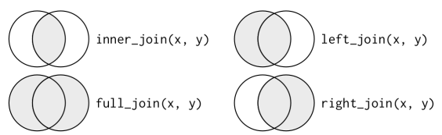
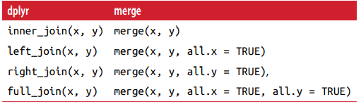
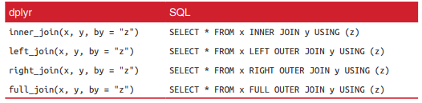
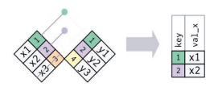
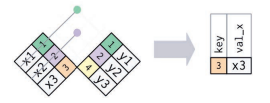
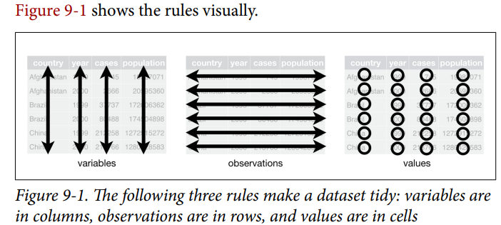
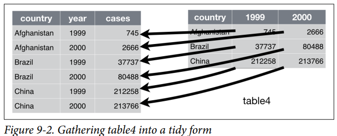
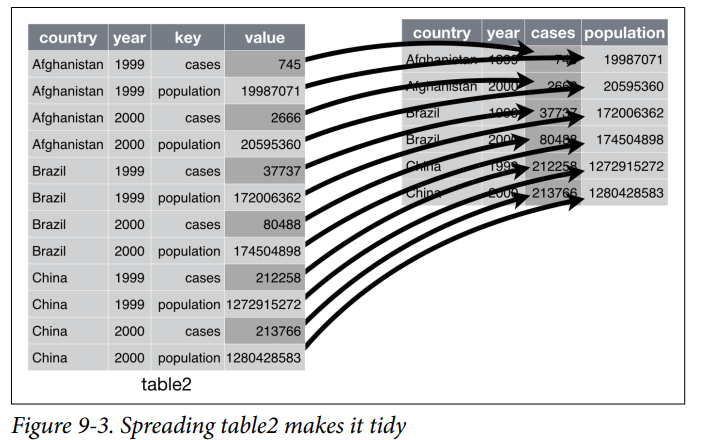
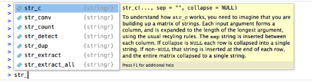

## Outline

-   Relational Data with dplyr
-   Tidy Data with tidyr
-   Strings with stringr

## 1. Relational Data with dplyr

```{r setup, include=FALSE}
library(tidyverse) 
library(nycflights13)

```

-   Keys: The variables used to connect each pair of tables are called keys. A key is a variable (or set of variables) that uniquely identifies an observation.

-   Once you've identified the primary keys in your tables, it's good practice to verify that they do indeed uniquely identify each observation.

```{r, include=TRUE}
library(tidyverse) 
library(nycflights13)
planes %>%
 count(tailnum) %>%
 filter(n > 1)

```

## 1.1 Mutating Joins

### 1.1.1 Types of Joins

{width="561"}

```{r}
flights2 <- flights %>%
 select(year:day, hour, origin, dest, tailnum, carrier)
flights2
flights2 %>%
 select(-origin, -dest) %>%
 left_join(airlines, by = "carrier")
```

### 1.1.2 Defining the Key Columns

-   The default, by = NULL, uses all variables that appear in both tables, the so-called natural join

```{r}
flights2 %>%
 left_join(weather)
```

-   A character vector, by = "x". This is like a natural join, but uses only some of the common variables.

```{r}
flights3 <- flights2 %>%
 left_join(planes, by = "tailnum")

```

-   A named character vector: by = c("a" = "b"). This will match variable a in table x to variable b in table y. The variables from x will be used in the output.

```{r}
flights2 %>%
 left_join(airports, c("dest" = "faa"))

```

### 1.1.3 Other Implementations

base::merge() can perform all four types of mutating join:



SQL is the inspiration for dplyr's conventions, so the translation is straightforward:



## 1.2 Filtering Joins

-   Filtering joins match observations in the same way as mutating joins, but affect the observations, not the variables.

-   • semi_join(x, y) keeps all observations in x that have a match in y.

    

-   • anti_join(x, y) drops all observations in x that have a match in y.

    

```{r}
top_dest <- flights %>%
 count(dest, sort = TRUE) %>%
 head(10)
top_dest
```

```{r}
flights %>%
 filter(dest %in% top_dest$dest)
```

-   But it's difficult to extend that approach to multiple variables.

```{r}
flights %>%
 semi_join(top_dest)
```

```{r}
flights %>%
 anti_join(planes, by = "tailnum") %>%
 count(tailnum, sort = TRUE)
```

## 1.3 Set Operations

-   intersect(x, y)\
    Return only observations in both x and y.
-   union(x, y)\
    Return unique observations in x and y.
-   setdiff(x, y)\
    Return observations in x, but not in y.

```{r}
df1 <- tribble(
 ~x, ~y,
 1, 1,
 2, 1
)
df2 <- tribble(
 ~x, ~y,
 1, 1,
 1, 2
)
intersect(df1, df2)
union(df1, df2)
setdiff(df1, df2)
```

## 2. Tidy Data with tidyr

### 2.1 Tidy Data

```{r}
library(tidyverse)
```

```{r}
table1
table2
table3
table4a
table4b
```

-   There are three interrelated rules which make a dataset tidy:

    1.  Each variable must have its own column.\
    2.  Each observation must have its own row.\
    3.  Each value must have its own cell.

    

### 2.2 Pivoting: pivot_longer() and pivot_wider()

```{r}
tidy4a <- table4a %>% 
  pivot_longer(c(`1999`, `2000`), names_to = "year", values_to = "cases")
tidy4b <- table4b %>% 
  pivot_longer(c(`1999`, `2000`), names_to = "year", values_to = "population")
left_join(tidy4a, tidy4b)

```



```{r}
table2 %>%
    pivot_wider(names_from = type, values_from = count)
```



### 2.3 tidyr: gather() and spread()(Switching to pivot_longer and pivot_wider in new version)

```{r}
tidy4a <- table4a %>%
 gather(`1999`, `2000`, key = "year", value = "cases")
tidy4b <- table4b %>%
 gather(`1999`, `2000`, key = "year", value = "population")
left_join(tidy4a, tidy4b)
```

```{r}
spread(table2, key = type, value = count)
```

### 2.4 Separate

```{r}
table3 %>%
 separate(rate, into = c("cases", "population"))
```

-   By default, separate() will split values wherever it sees a nonalphanumeric character (i.e., a character that isn't a number or letter)

```{r}
table3 %>%
 separate(rate, into = c("cases", "population"), sep = "/")
table3 %>% 
  separate(year, into = c("century", "year"), sep = 2)
```

### 2.5 Unite

```{r}
table5
table5 %>%
 unite(new, century, year)

```

-   The default will place an underscore (\_) between the values from different columns.

```{r}
table5 %>%
 unite(new, century, year, sep = "")
```

### 2.6 Missing Values

-   Explicitly, i.e., flagged with NA.\
-   Implicitly, i.e., simply not present in the data.

```{r}
stocks <- tibble(
 year = c(2015, 2015, 2015, 2015, 2016, 2016, 2016),
 qtr = c( 1, 2, 3, 4, 2, 3, 4),
 return = c(1.88, 0.59, 0.35, NA, 0.92, 0.17, 2.66)
)
stocks

stocks %>%
  pivot_wider(names_from = year, values_from = return)

```

-   set values_drop_na = TRUE in pivot_longer() to turn explicit missing values implicit

```{r}
stocks %>% 
  pivot_wider(names_from = year, values_from = return) %>% 
  pivot_longer(
    cols = c(`2015`, `2016`), 
    names_to = "year", 
    values_to = "return", 
    values_drop_na = TRUE
  )

```

-Another important tool for making missing values explicit in tidy data is complete(): - complete() takes a set of columns, and finds all unique combinations. It then ensures the original dataset contains all those values, filling in explicit NAs where necessary.

```{r}
stocks
stocks %>% 
  complete(year, qtr)
```

-   Sometimes when a data source has primarily been used for data entry, missing values indicate that the previous value should be carried forward: fill()

```{r}
treatment <- tribble(
  ~ person,           ~ treatment, ~response,
  "Derrick Whitmore", 1,           7,
  NA,                 2,           10,
  NA,                 3,           9,
  "Katherine Burke",  1,           4
)
treatment %>% 
  fill(person)
```

## 3. Strings with stringr

### 3.1 Prerequisites

```{r}
library(tidyverse)
```

## 3.2 String basics

```{r}
string1 <- "This is a string"
string2 <- 'If I want to include a "quote" inside a string, I use single quotes'

string1
string2
writeLines(string2)
```

-   To include a literal single or double quote in a string you can use \\ to "escape" it:

```{r}
double_quote <- "\"" # or '"'
single_quote <- '\'' # or "'"
```

-   That means if you want to include a literal backslash, you'll need to double it up: "\\\\"

```{r}
x <- c("\"", "\\")
x
writeLines(x)
```

-   If you forget to close a quote, you'll see +, the continuation character: \>

> "This is a string without a closing quote\
> +\
> +\
> + HELP I'M STUCK

-   If this happen to you, press Escape and try again!

-   other special characters\
    "\\n", newline\
    "\\t", tab\
    "\\u00b5"\
    the complete list by requesting help on ": ?'"', or ?"'"

-   Multiple strings are often stored in a character vector, which you can create with c():

```{r}
c("one", "two", "three")
```

### 3.2.1 String length

-   functions from stringr
-   The common str\_ prefix is particularly useful if you use RStudio



-   example

```{r}
str_length(c("a", "R for data science", NA))
```

### 3.2.2 Combining strings

```{r}
str_c("x", "y")
str_c("x", "y", sep = ", ")
```

-   Like most other functions in R, missing values are contagious. If you want them to print as "NA", use str_replace_na():

```{r}
x <- c("abc", NA)
str_c("|-", x, "-|")
str_c("|-", str_replace_na(x), "-|")

```

-   Objects of length 0 are silently dropped. This is particularly useful in conjunction with if:

```{r}
name <- "Hadley"
time_of_day <- "morning"
birthday <- FALSE

str_c(
  "Good ", time_of_day, " ", name,
  if (birthday) " and HAPPY BIRTHDAY",
  "."
)

```

-   To collapse a vector of strings into a single string, use collapse:

```{r}
str_c(c("x", "y", "z"), collapse = ", ")
```

### 3.2.3 Subsetting strings

-   str_sub() takes start and end arguments which give the (inclusive) position of the substring:

```{r}
x <- c("Apple", "Banana", "Pear")
str_sub(x, 1, 3)
str_sub(x, -3, -1)
```

-   Note that str_sub() won't fail if the string is too short: it will just return as much as possible:

```{r}
str_sub("a", 1, 5)
```

-   You can also use the assignment form of str_sub() to modify strings:

```{r}
str_sub(x, 1, 1) <- str_to_lower(str_sub(x, 1, 1))
x
```

### 3.2.4 Locales

```{r}
# Turkish has two i's: with and without a dot, and it
# has a different rule for capitalising them:
str_to_upper(c("i", "ı"))
str_to_upper(c("i", "ı"), locale = "tr")
```

-   The base R order() and sort() functions sort strings using the current locale. If you want robust behaviour across different computers, you may want to use str_sort() and str_order() which take an additional locale argument:

```{r}
x <- c("apple", "eggplant", "banana")

str_sort(x, locale = "en")  # English

str_sort(x, locale = "haw") # Hawaiian

```

## 3.3 Matching patterns with regular expressions

-   To learn regular expressions, we'll use str_view() and str_view_all()

### 3.3.1 Basic matches

```{r, out.height="50%"}
x <- c("apple", "banana", "pear")
str_view(x, "an")
```

- The next step up in complexity is ., which matches any character (except a newline):

```{r}
str_view(x, ".a.")
```

-   But if "." matches any character, how do you match the character "."?

```{r}
# To create the regular expression, we need \\
dot <- "\\."

# But the expression itself only contains one:
writeLines(dot)

# And this tells R to look for an explicit .
str_view(c("abc", "a.c", "bef"), "a\\.c")
```

-   If \\ is used as an escape character in regular expressions, how do you match a literal ?

```{r, echo=TRUE}
x <- "a\\b"
writeLines(x)

str_view(x, "\\\\")
```

### 3.3.2 Anchors

-   It's often useful to anchor the regular expression so that it matches from the start or end of the string.

    \^ to match the start of the string.   
    \$ to match the end of the string.

```{r}
x <- c("apple", "banana", "pear")
str_view(x, "^a")
str_view(x, "a$")
```

-   you begin with power (\^), you end up with money (\$).

```{r}
x <- c("apple pie", "apple", "apple cake")
str_view(x, "apple")
str_view(x, "^apple$")
```

-   You can also match the boundary between words with \\b. \\bsum\\b

### 3.3.3 Character classes and alternatives

\\d: matches any digit.\
\\s: matches any whitespace (e.g. space, tab, newline).\
[abc]: matches a, b, or c.\
[\^abc]: matches anything except a, b, or c.\

Remember, to create a regular expression containing \\d or \\s, you'll need to escape the \\ for the string, so you'll type "\\\\d" or "\\\\s".

```{r}
# Look for a literal character that normally has special meaning in a regex
str_view(c("abc", "a.c", "a*c", "a c"), "a[.]c")
str_view(c("abc", "a.c", "a*c", "a c"), ".[*]c")

```

- This works for most (but not all) regex metacharacters: $ . | ? * + ( ) [ {. Unfortunately, a few characters have special meaning even inside a character class and must be handled with backslash escapes: ] \\ ^ and -


- use alternation to pick between one or more alternative patterns. For example,

  abc|d..f will match either ‘“abc”’, or "deaf"   
  abc|xyz matches abc or xyz not abcyz or abxyz
```{r}
str_view(c("grey", "gray"), "gr(e|a)y")
```
  
### 3.3.4 Repetition
- The next step up in power involves controlling how many times a pattern matches:

  ?: 0 or 1  
  +: 1 or more  
  *: 0 or more  
```{r}
x <- "1888 is the longest year in Roman numerals: MDCCCLXXXVIII"
str_view(x, "CC?")
str_view(x, "CC+")
str_view(x, 'C[LX]+')
```
  
- Note that the precedence of these operators is high, that means most uses will need parentheses, like bana(na)+  
  
- You can also specify the number of matches precisely:

  {n}: exactly n  
  {n,}: n or more  
  {,m}: at most   
  {n,m}: between n and m  
  
```{r}
str_view(x, "C{2,3}")
str_view(x, 'C{2,3}?')
```
  
### 3.3.5 Grouping and backreference
- Another Way by a capturing group with backreferences, like \1, \2 etc. 

```{r}
str_view(fruit, "(..)\\1", match = TRUE)
fruittt <- c("banbnanbn", "banbnbnan", "papaya")
str_view(fruittt, "(..)(..)\\1\\2", match = TRUE)
str_view(fruittt, "(..)(..)\\2\\1", match = TRUE)
```

## 3.4 Tools

### 3.4.1 Detect matches

- To determine if a character vector matches a pattern, use str_detect()

```{r}
x <- c("apple", "banana", "pear")
str_detect(x, "e")
```

- Use sum() and mean()
```{r}
# How many common words start with t?
sum(str_detect(words, "^t"))

# What proportion of common words end with a vowel?
mean(str_detect(words, "[aeiou]$"))
```

-  complex logical conditions, For example, here are two ways to find all words that don’t contain any vowels
```{r}
# Find all words containing at least one vowel, and negate
no_vowels_1 <- !str_detect(words, "[aeiou]")
# Find all words consisting only of consonants (non-vowels)
no_vowels_2 <- str_detect(words, "^[^aeiou]+$")
identical(no_vowels_1, no_vowels_2)
```

- A common use of str_detect() is to select the elements that match a pattern. You can do this with logical subsetting, or the convenient str_subset() wrapper:

```{r}
words[str_detect(words, "x$")]
str_subset(words, "x$")
```

- Typically, however, your strings will be one column of a data frame, and you’ll want to use filter instead:

```{r}
df <- tibble(
  word = words, 
  i = seq_along(word)
)
df %>% 
  filter(str_detect(word, "x$"))
```

- A variation on str_detect() is str_count()

```{r}
x <- c("apple", "banana", "pear")
str_count(x, "a")
```

- Note that matches never overlap.

```{r}
str_count("abababa", "aba")
```

### 3.4.2 Extract matches

- To extract the actual text of a match, use str_extract()
```{r}
length(sentences)
head(sentences)
```

- Imagine we want to find all sentences that contain a colour.
```{r}
colours <- c("red", "orange", "yellow", "green", "blue", "purple")
colour_match <- str_c(colours, collapse = "|")
colour_match
```

- Now we can select the sentences that contain a colour, and then extract the colour to figure out which one it is:

```{r}
has_colour <- str_subset(sentences, colour_match)
matches <- str_extract(has_colour, colour_match)
head(matches)
```

- Note that str_extract() only extracts the first match. We can see that most easily by first selecting all the sentences that have more than 1 match

```{r}
more <- sentences[str_count(sentences, colour_match) > 1]
str_view_all(more, colour_match)

str_extract(more, colour_match)
```

- To get all matches, use str_extract_all()
```{r}
str_extract_all(more, colour_match)
```

- If you use simplify = TRUE, str_extract_all() will return a matrix with short matches expanded to the same length as the longest:

```{r}
str_extract_all(more, colour_match, simplify = TRUE)
```

### 3.4.3 Grouped matches

- use parentheses to extract parts of a complex match. For example, imagine we want to extract nouns from the sentences.

```{r}
noun <- "(a|the) ([^ ]+)"

has_noun <- sentences %>%
  str_subset(noun) %>%
  head(10)
has_noun %>% 
  str_extract(noun)
```

- str_extract() gives us the complete match; str_match() gives each individual component. 
```{r}
has_noun %>% 
  str_match(noun)
```

- If your data is in a tibble, it’s often easier to use tidyr::extract().

```{r}
tibble(sentence = sentences) %>% 
  tidyr::extract(
    sentence, c("article", "noun"), "(a|the) ([^ ]+)", 
    remove = FALSE
  )
```

### 3.4.4 Replacing matches

- str_replace() and str_replace_all() allow you to replace matches with new strings.

```{r}
x <- c("apple", "pear", "banana")
str_replace(x, "[aeiou]", "-")
str_replace_all(x, "[aeiou]", "-")
```

- With str_replace_all() you can perform multiple replacements by supplying a named vector:

```{r}
x <- c("1 house", "2 cars", "3 people")
str_replace_all(x, c("1" = "one", "2" = "two", "3" = "three"))
```

- Instead of replacing with a fixed string you can use backreferences to insert components of the match
```{r}
sentences %>% 
  str_replace("([^ ]+) ([^ ]+) ([^ ]+)", "\\1 \\3 \\2") %>% 
  head(5)
```

### 3.4.5 Splitting

- Use str_split() to split a string up into pieces.

```{r}
aa <- "a|b|c|d" %>% 
  str_split("\\|")
aa
```

- Otherwise, like the other stringr functions that return a list, you can use simplify = TRUE to return a matrix
```{r}
sentences %>%
  head(5) %>% 
  str_split(" ")
sentences %>%
  head(5) %>% 
  str_split(" ", simplify = TRUE)
```

- You can also request a maximum number of pieces:

```{r}
fields <- c("Name: Hadley: Hadley", "Country: NZ: Hadley", "Age: 35: Hadley")
fields %>% str_split(": ", n = 2, simplify = TRUE)
```

- Instead of splitting up strings by patterns, you can also split up by character, line, sentence and word boundary()s:

```{r}
str_split(x, " ")[[1]]
str_split(x, boundary("word"))[[1]]
```

### 3.4.6 Find matches

- str_locate() and str_locate_all() give you the starting and ending positions of each match.

## 3.5 Other types of pattern

- When you use a pattern that’s a string, it’s automatically wrapped into a call to regex():

\# The regular call:  
str_view(fruit, "nana")  
\# Is shorthand for  
str_view(fruit, regex("nana"))   

- You can use the other arguments of regex() to control details of the match:

  a. ignore_case = TRUE allows characters to match either their uppercase or lowercase forms. This always uses the current locale.

```{r}
bananas <- c("banana", "Banana", "BANANA")
str_view(bananas, "banana")
str_view(bananas, regex("banana", ignore_case = TRUE))
```
  b. multiline = TRUE allows ^ and $ to match the start and end of each line rather than the start and end of the complete string.
```{r}
x <- "Line 1\nLine 2\nLine 3"
str_extract_all(x, "^Line")[[1]]
str_extract_all(x, regex("^Line", multiline = TRUE))[[1]]
```
  c. comments = TRUE allows you to use comments and white space to make complex regular expressions more understandable. Spaces are ignored, as is everything after #. To match a literal space, you’ll need to escape it: "\\\\ ".
```{r}
phone <- regex("
  \\(?     # optional opening parens
  (\\d{3}) # area code
  [) -]?   # optional closing parens, space, or dash
  (\\d{3}) # another three numbers
  [ -]?    # optional space or dash
  (\\d{3}) # three more numbers
  ", comments = TRUE)

str_match("514-791-8141", phone)

```
  d. dotall = TRUE allows . to match everything, including \\n.

- There are three other functions you can use instead of regex():

  a. fixed(): matches exactly the specified sequence of bytes. It ignores all special regular expressions and operates at a very low level. This allows you to avoid complex escaping and can be much faster than regular expressions.  
  b.coll(): compare strings using standard collation rules.   
  c. As you saw with str_split() you can use boundary() to match boundaries.

## 3.6 Other uses of regular expressions

- apropos() searches all objects available from the global environment. This is useful if you can’t quite remember the name of the function.

```{r}
apropos("replace")
```
- dir() lists all the files in a directory.  For example, you can find all the R Markdown files in the current directory with:

```{r}
head(dir(pattern = "\\.Rmd$"))
```

```{r IwinERRR,results="as-is",engine="js", echo=FALSE }

tellMe = document.querySelectorAll('div.html-widget');

for(i = 0; i < tellMe.length; i++){
  tellMe[i].style.width = 'fit-content'; // works for browsers other than IE
  tellMe[i].style.height = 'fit-content';
}

```

