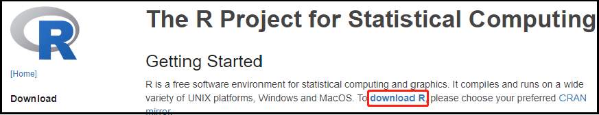
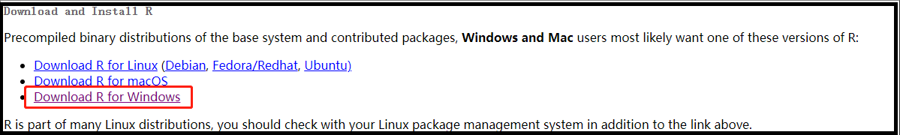

```{r setup, include=FALSE}
#global options
knitr::opts_chunk$set(echo = FALSE) #Default hidden code
```

## Outline

-   What is R?
-   Why R?
-   How to use R?
-   R Markdown

## 1. what is R?

-   R is a language and environment for statistical computing and graphics created by Ross Ihaka and Robert Gentleman in 1992. The term "R" was derived from the first letter of its two authors' names. R is an implementation of the S language which is a interpreted language developed at AT&T Bell Laboratories for data exploration, statistical analysis and graphing in 1976.

-   R is open-source and is widely used among data miners, bioinformaticians and statisticians.

-   In the application of business, it also includes banking, Internet, pharmaceutical companies and so on.

-   An initial version released in 1995 and a stable version in 2000. The latest version is 4.2.0 (April, 2022).


## 2. Why R?

### 2.1 Features of R

-   *Free Installation*

-   *Platform Independent* (Linux, macOS, Windows)

-   *Hottest Trend*\
     

-   *Vast community*

    Stack overflow: <https://stackoverflow.com/questions/tagged/r>\
    R-Bloggers: <https://www.r-bloggers.com>\
    Tidyverse: <https://www.tidyverse.org>\
    Rstudio: [https://community.rstudio.com](https://rstudio.com){.uri}\
    统计之都 (Capital of Statistics, COS)：<https://d.cosx.org>\
    The latest free books for R：<https://www.bookdown.org>

-   *Integrate with Other Language* (SAS, Python, C++, etc)

-   *Powerful graphics function* (ggplot2, lattice)\
    {width="8in"} 

------------------------------------------------------------------------

### 2.2 R's use at FDA

-   ***SAS is not required to be used for clinical trials.***

    -   The origin of the fallacy that "SAS IS required by FDA" is probably related to the fact that data must be submitted in the XPT "transport format" (which was originally created by SAS).

    -   XPT files can be read into R with the standard read_xpt function, and exported from R with the write_xpt function.

    -   Actually, at the UseR 2012 conference, FDA biostatistician Jae Brodsky reiterated the FDA policy regarding software used to prepare submissions for drug approvals with clinical trials: Sponsors may use R in their submissions.\
        \>[Some Challenges of Using R in a Regulatory Environment] (<https://blog.revolutionanalytics.com/downloads/FDA-Janice-Brodsky-UseR-2012.pdf>)

        -   FDA offices use R on a daily basis-includes Office of Biostatistics
        -   FDA scientists have written R packages for other scientists'use (FDA or non-FDA)
        -   FDA does not endorse or require the use of any specific software for statistical analysis

-   [***Successful R-based Test Package Submitted to FDA on 2021-11-22***]{style="color:red"}

\
All submission materials can be found at: <https://github.com/RConsortium/submissions-pilot1-to-fda>

------------------------------------------------------------------------

## 3. How to use R?

### 3.1 Preparation

Recommended text books:\
- [R in Action](https://www.manning.com/books/r-in-action-second-edition)\
- [R for Data Science](https://r4ds.had.co.nz/)

### 3.2 Set up R environment

#### 3.2.1 Install R (<https://www.r-project.org/>)

[step1:]{style="color:red"}

\
[step2:]{style="color:red"}

\
[step3: please choose a location close to you]{style="color:red"}

\
[step4:]{style="color:red"}

\
[step5:]{style="color:red"}

\
[step6:]{style="color:red"}

\
[step7:]{style="color:red"}


#### 3.2.2 Update R

Run code below on RGUI to update R version.

```{r echo=TRUE, eval=FALSE}
install.packages("installr")
library(installr)
updateR()
```

------------------------------------------------------------------------

#### 3.2.3 Install RStudio (<https://www.rstudio.com/products/rstudio/download/>)

-   RStudio is an integrated development environment (IDE) for R. The interface is more rich and practical, and it is more convenient to use.

[step1:]{style="color:red"}

\
[step2:]{style="color:red"}


-   When open RStudio after installation, you might get a warning like this:\
    \
    [Solution for R \< 4.2.0]{style="color:red"} - Find R installation directory, then go to Library -\> Base -\>R, use TXT to open Rprofile and add the following statement to it:\
    Sys.setenv(R_USER="C:/")\
    [Solution for R 4.2.0: Pending]{style="color:red"}

#### 3.2.4 Update RStudio

Help -\> Check for update

------------------------------------------------------------------------

#### 3.2.5 Install Rtools (<https://mirrors.bfsu.edu.cn/CRAN/>)

-   Tools to build R and R packages.

[step1:]{style="color:red"}

\
[step2:]{style="color:red"}


[step3:]{style="color:red"}


[step4: Open Rsudio and run code below]{style="color:red"}

```{r, echo=TRUE, eval=FALSE}
#put the location of the Rtools make utilities (bash, make, etc) on the PATH
write('PATH="${RTOOLS40_HOME}\\usr\\bin;${PATH}"', file = "~/.Renviron", append = TRUE)

#restart R and verify
Sys.which("make")

#if installed successfully then completed, otherwise go to step5
install.packages("jsonlite", type = "source") 
```

[step5: Set up manually if step4 failed]{style="color:red"}

{width="15in"}

------------------------------------------------------------------------

### 3.3 R Package

#### 3.3.1 What is R package?

-   A package bundles together code, data, documentation and tests to perform a desired function or specific task, and is easy to share with others.\
-   It can be developed by anyone.\
-   Currently, there are over 100 thousand available packages.\
-   R Package Documentation (A comprehensive index of R packages and documentation from CRAN, Bioconductor, GitHub and R-Forge.): <https://rdrr.io>

#### 3.3.2 Install R packages

[*Method 1: Install Online*]{style="color:blue"}

| Repositories                                   | Installation Method                                                                                               |
|:-----------------------------------------------|:------------------------------------------------------------------------------------------------------------------|
| CRAN (<https://mirrors.bfsu.edu.cn/CRAN/>)     | install.packages("package_name")                                                                                  |
| Github (<https://github.com/>)                 | devtools::install_github("package name") or remotes::install_github("package_name")                               |
| Bioconductor (<https://www.bioconductor.org/>) | if (!require("BiocManager", quietly = TRUE)) install.packages("BiocManager") BiocManager::install("package_name") |

[*Method 2: Install from Local*]{style="color:blue"}

-   Download package released file: .zip\
-   Tools -\> Install Packages: Install from: choose "Package Archive File (.zip; .tar.gz)"; Package archive: choose the directory of package archive file

#### 3.3.3 R packages operations

-   Use R packages: library(package_name)
-   Update single R package: update.packages ("package_name")
-   Update all R packages: update.packages()
-   Delete R packages: remove.packages("package_name")

------------------------------------------------------------------------

### 3.4 R project management

#### 3.4.1 Working Path

-   Use relative path instead of absolute path

root directory of windows: C:/

current directory: ./

up-level directory: ../

-   Use function getwd() to view current path

-   Use function setwd() to set up current path

-   Use / or \\\\ instead of \\ in the path

    Below is a example for relative path:

    ```{r working path, echo=TRUE, eval=F}
    getwd()
    setwd("../")
    getwd()
    setwd("./QY_R")
    getwd()
    ```

### 3.4.2 R project

-   Project File -\> New Project -\> Create a project with new directory or existing directory

------------------------------------------------------------------------

## 4. R Markdown

### 4.1 Introduction

-   Markdown is a Lightweight markup language which allow user to write with plain text format then covert to HTML document.

-   R Markdown insert R codes to Markdown file to generate a document combining code, output and explanation which make it easier to share with others.

-   We can use it for learning R by helping keep track of notes and thinking process all while creating a custom reference document.

-   R markdown file is a plain text file that has the extension .Rmd. The output format can be HTML, Docx, PDF, etc.

-   A comprehensive resources of R Markdown: <https://pkgs.rstudio.com/rmarkdown/articles/rmarkdown.html>

### 4.2 Installation

We have to install package: rmarkdown.

```{r, echo=TRUE, eval=FALSE}
install.packages("rmarkdown")
```

### 4.3 R Markdown Basics

#### 4.3.1 New R Markdown file

File -\> New file -\> R Markdown -\> choose output format

#### 4.3.2 elements

-   YAML header surrounded by ---s

-   Code chunk surrounded by \`\`\`s

    -   Insert code chunk:

        -   Ctrl + Alt + I
        -   Use add chunk command in the editor toolbar
        -   manually type the chunk delimiters\

    -   Chunk options:

        -   (include = FALSE) prevents code and results from appearing in the finished file. R Markdown still runs the code in the chunk, and the results can be used by other chunks.\
        -   (echo = FALSE) prevents code, but not the results from appearing in the finished file. This is a useful way to embed figures.\
        -   (message = FALSE) prevents messages that are generated by code from appearing in the finished file.\
        -   (warning = FALSE) prevents warnings that are generated by code from appearing in the finished.\
        -   (fig.cap = "...") adds a caption to graphical results.

        *See [R Markdown Reference Guide](https://www.rstudio.com/wp-content/uploads/2015/03/rmarkdown-reference.pdf) for a complete list of chunk options.*

-   Formatted text

    -   Plain text
    -   End a line with two spaces to start a new paragraph.
    -   separator lines: \*\*\* and ---
    -   *italics* and *italics*
    -   **bold** and **bold**
    -   ***italics and bold*** and ***italics and bold***
    -   [color]{style="color:red"}
    -   superscript^2^ and superscript~2~
    -   ~~strikethrough~~
    -   [hyperlink](www.rstudio.com)
    -   \
    -   Find the LaTex makeup (<http://www.codecogs.com/latex/eqneditor.php>)\
        For example: $\chi ^{2} = \sum_{i=1}^{n}\frac{(O_{i} - E_{i})^{2}}{E_{i}}$\
    -   The following symbols need to be preceded by  to help insert ordinary symbols:\
        \\ \` \* \_ { [ ( \# + - . !
    -   Markdown table (<https://www.tablesgenerator.com/markdown_tables>)

| Table Header | Second Header | Third Header |
|:-------------|:-------------:|-------------:|
| Cell 1       |    Cell 2     |       Cell 3 |
| Cell 4       |    Cell 5     |       Cell 6 |

#### 4.3.3 Write Markdown in the RStudio visual editor

If you are not familiar with Markdown yet, or do not prefer writing Markdown code, suggest to try the visual editor for Markdown documents.

------------------------------------------------------------------------

{width="10in"}
