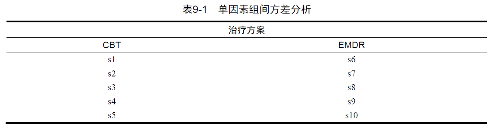
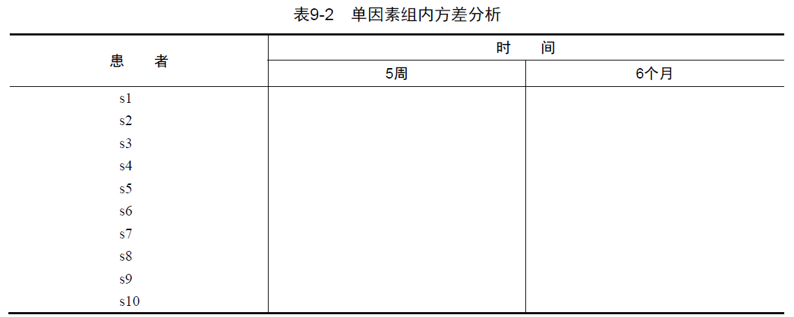
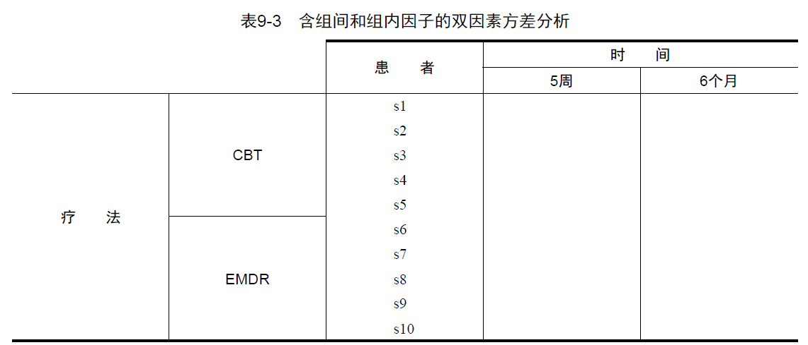
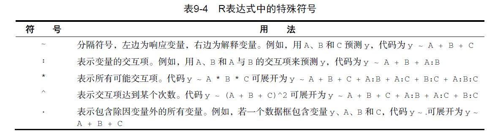
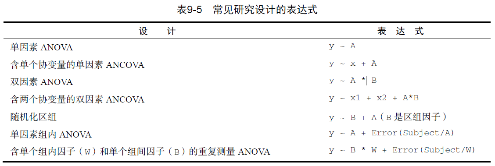
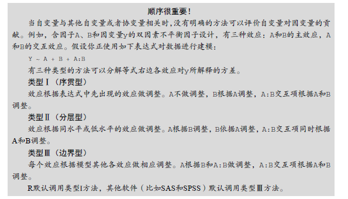

```{r setup, include=FALSE}
knitr::opts_chunk$set(echo = TRUE)
```

## Outline

1.  Descriptive Statistical Analysis
2.  Independence Test
3.  Correlation Analysis
4.  T Test
5.  Nonparametric Test
6.  ANOVA

## 1. Descriptive Statistical Analysis

### 1.1 Descriptive statistics: mean, median, std, min, max, quantile,...

```{r echo=TRUE, message=FALSE, warning=FALSE}
library(sas7bdat)
adsl <- read.sas7bdat("./data/sas/adsl.sas7bdat")
attach(adsl)
mean(AGE)
sd(AGE)
median(AGE)
quantile(AGE)
min(AGE)
max(AGE)
summary(AGE)
library(Hmisc)
describe(AGE)
#help('describe')
detach(adsl)
```

## 1.2 Handling Missing Value

```{r message=FALSE, warning=FALSE}
attach(adsl)
aage <- ifelse (AGE < 20, NA, AGE)
mean(aage)
mean(aage,na.rm=T)
min(aage)
min(aage,na.rm=T)
summary(aage)
detach(adsl)
```

## 1.3 sapply (x, FUN)

```{r message=FALSE, warning=FALSE}
mystats <- function(x, na.omit=FALSE){
if (na.omit)
x <- x[!is.na(x)]
m <- mean(x)
n <- length(x)
s <- sd(x)
skew <- sum((x-m)^3/s^3)/n
kurt <- sum((x-m)^4/s^4)/n - 3
return(c(n=n, mean=m, stdev=s, skew=skew, kurtosis=kurt))
}
myvars <- c("AGE", "EOSDY")
sapply(adsl[myvars], mystats)
```

## 1.4 Calculation by group

### 1.4.1 tapply (x, index, FUN)

```{r message=FALSE, warning=FALSE}
attach(adsl)
tapply(AGE,TRT01A,mean)
xbar <- tapply(AGE, TRT01A, mean)
s <- tapply(AGE, TRT01A, sd)
n <- tapply(AGE, TRT01A, length)
all <- rbind(mean=xbar, std.dev=s, n=n)
all
tapply(AGE,TRT01A,summary)
detach(adsl)
```

## 1.4.2 aggregate (x, by, FUN)

```{r message=FALSE, warning=FALSE}
attach(adsl)
#If using list(SEX), the am column will be labeled as Group.1 instead of SEX. You use this assignment to specify a more helpful column label.
aggregate(AGE, by=list(SEX, TRT01A), mean)
aggregate(AGE, by=list(SEX=SEX, TRT=TRT01A), mean)
detach(adsl)
```

## 1.4.3 by (data, indices, FUN)

```{r message=FALSE, warning=FALSE}
attach(adsl)
by(AGE, SEX, summary)
by(AGE, SEX, min)
detach(adsl)
```

### 1.4.4 describeBy(x, group)

```{r message=FALSE, warning=FALSE}
library(psych)
attach(adsl)
describeBy(AGE, list(SEX=SEX))
detach(adsl)
```

## 2. Frequency tables and contingency tables

*table(var1, var2, ..., varN):* N-dimensional contingency table

*xtabs(formula, data):* N-dimensional contingency table

*prop.table(table, margins):* Shown in fractional form according to margins

*margin.table(table, margins):* Calculated of sum according to margins

*addmargins(table, margins):* add margins

*ftable(table)*: Tiled contingency table

```{r message=FALSE, warning=FALSE}
#One dimensional contingency table
attach(adsl)
library(dplyr)
library(janitor)
table(SEX, useNA="ifany") #table()函数默认忽略缺失值（NA）,要在频数统计中将NA视为一个有效的类别，请设定参数useNA="ifany"。
prop.table(with(adsl, table(SEX)))
round(prop.table(with(adsl, table(SEX)))*100, 1)

#Two dimensional contingency table
trt.sex <- table(SEX, TRT01A)
trt.sex
trt.sex1 <- xtabs(~ SEX+TRT01A)
trt.sex1
margin.table(trt.sex,1) #1代表第一个变量（行），margin.table边际频数
prop.table(trt.sex, 1)  #prop.table边际比例
margin.table(trt.sex,2) #2代表第二个变量（列）
prop.table(trt.sex, 2)
addmargins(trt.sex) #addmargin边际和，默对所有的变量
addmargins(prop.table(trt.sex, 1), 2)
addmargins(prop.table(trt.sex, 2), 1)

#Multidimensional Contingency table
mul <- xtabs(~ TRT01A+RACE+SEX)
mul
ftable(mul)
ftable(addmargins(prop.table(mul, c(1, 2)), 3)) * 100

#Dataset of frequency
tab1 <- data.frame(SEX, TRT01A)
tab2 <- tab1 %>%  
  tabyl(SEX, TRT01A)
tab2
taba<- tab2%>% 
  adorn_totals( where = c("row", "col") ) %>%
  adorn_percentages("col") %>%
  adorn_pct_formatting(digits = 2) %>%
  adorn_ns(position = "front" )
taba

library(table1)
table1(~ AGE+SEX | TRT01A, data=adsl, overall = "Total")
detach(adsl)
```

## 3. Independence Test

### 3.1 Chi-square test

```{r message=FALSE, warning=FALSE}
library(vcd)
attach(Arthritis)
mytable <- xtabs(~Treatment+Improved)
mytable
library(gmodels)
CrossTable(Treatment, Improved, expected=T, fisher = F, format="SAS")
chisq.test(mytable, correct=F) #correct=T(default)
detach(Arthritis)
```

## 3.2 Fisher test

```{r message=FALSE, warning=FALSE}
fisher.test(mytable)
```

### 3.3 Cochran-Mantel-Haenszel test

```{r message=FALSE, warning=FALSE}
attach(Arthritis)
data1 <- xtabs(~Treatment+Improved+Sex)
mantelhaen.test(data1)
detach(Arthritis)
```

## 4. Correlation Analysis

### 4.1 Pearson, Spearman and Kendall

cor (x, use, method)

x: matrix or data frame

use: specify how missing data are handled.

1.  *all.obs*: no missing data were assumed

2.  *everything*(default): set missing data as missing for calculation

3.  *complete.obs*: delete row of missing data

4.  *pairwise.comlete.obs*: pairwise deletion

method: pearson(default), spearman, kendall

```{r message=FALSE, warning=FALSE}
states<- state.x77[,1:6]
cov(states)
cor(states)
```

## 4.2 Significance Test of Correlation

After calculating the correlation coefficient, we need to test its statistical significance. The null hypothesis is generally: there is no correlation between the two variables, that is, the correlation coefficient is 0.

cor.test(x, y, alternative = , method = )

x, y: variables tested for correlation

alternative: one-sided test or two-sided test ("*two.side*"(default), "less", "greater")

method: pearson, spearman, kendall

```{r message=FALSE, warning=FALSE}
#Income~HS Grad
cor.test(states[,2], states[,6])
library(psych)
corr.test(states)
```

## 4.3 Partial Correlation

pcor(u, S)

u: a vector of integers of length \> 1. The first two integers are the indices of variables the correlation of which must be computed. The rest of the vector is the conditioning set.

S: covariance matrix

```{r message=FALSE, warning=FALSE}
library(ggm)
colnames(states)
pcor(c(1,5,2,3,6), cov(states))
```

Significance test: pcor.test(r, q, n)

1.  r is the partial correlation coefficient calculated from the pcor() function,

2.  q is the number of variables to be controlled,

3.  n is Sample size.

```{r message=FALSE, warning=FALSE}
pcor.test(pcor(c(1,5,2,3,6), cov(states)),3,nrow(states))
```

## 5. T Test

+------------------------------------+---------------------+-------------------------+---------------------------------------------+
| Tests                              | Normal Distribution | Homogeneity of Variance | R                                           |
|                                    |                     |                         |                                             |
|                                    | *shapiro.test()*    | *var.test()*            |                                             |
+:===================================+:====================+=========================+:============================================+
| t test                             | Yes                 | Yes                     | t.test(y \~ x, data, ***var.equal=TRUE***)  |
+------------------------------------+---------------------+-------------------------+---------------------------------------------+
| t' test                            | Yes                 | No                      | t.test(y \~ x, data, ***var.equal=FALSE***) |
+------------------------------------+---------------------+-------------------------+---------------------------------------------+
| wilcoxon rank sum test (2 samples) | No                  | \-                      | wilcox.test(y \~ x, data)                   |
+------------------------------------+---------------------+-------------------------+---------------------------------------------+
| kruskal-wallis test (\>2 samples)  | No                  | \-                      | kruskal.test(y \~ A, data)                  |
+------------------------------------+---------------------+-------------------------+---------------------------------------------+

## 5.1 T-test of Independent Samples

```{r message=FALSE, warning=FALSE}
library(MASS)
attach(UScrime)
#prob: robability of imprisonment.
#So: indicator variable for a Southern state.
shapiro.test(Prob[So==0])
shapiro.test(Prob[So==1])
var.test(Prob ~ So, data=UScrime)
#Normal Distribution: p>0.05
#Homogeneity of Variance: p>0.05
t.test(Prob ~ So, data=UScrime)
t.test(Prob ~ So, data=UScrime, var.equal=F)
detach(UScrime)
```

## 5.2 T-test of Non-independent Samples

```{r message=FALSE, warning=FALSE}
#U1: unemployment rate of urban males 14–24.
#U2: unemployment rate of urban males 35–39.
sapply(UScrime[c("U1","U2")], function(x)(c(mean=mean(x),sd=sd(x))))
with(UScrime, t.test(U1, U2, paired=TRUE))
```

## 6. Nonparametric Test

### 6.1 Two-samples

```{r message=FALSE, warning=FALSE}
wilcox.test(Prob ~ So, data=UScrime)
```

### 6.2 Multiple-samples

#### 6.2.1 kruskal-wallis test (Independent)

```{r message=FALSE, warning=FALSE}
states <- data.frame(state.region, state.x77)
states
levels(state.region)
kruskal.test(Illiteracy ~ state.region, data=states)
```

#### 6.2.2 Friedman test (Non-independent)

```{r message=FALSE, warning=FALSE}
#friedman.test(y ~ A | B, data)
```

## 7. ANOVA

### 7.1 Overview

ANOVA is used to test the significance of the difference between the means of two or more samples.

Conditions:

1.  Samples conformed to a normal distribution.

2.  Samples are independent of each other.

3.  The variance of the samples is consistent.







ANCOVA: covariance analysis

MANOVA: multivariate analysis of variance

MANCOVA: multivariate analysis of covariance

## 7.2 aov(formula, data=dataframe)





{width="689"}

[**Type I: R.cov()**]{.underline}

[**Type III: R.Anova(), SAS, SPSS**]{.underline}

## 7.3 One-way ANOVA

### 7.3.1 Assess the conditions for hypothesis testing

```{r message=FALSE, warning=FALSE}
# Assessing normality
library(car)
library(multcomp)
attach(cholesterol)
#trt: treatment group; response: cholesterol reduction.
levels(trt)
qqPlot(lm(response ~ trt, data=cholesterol), 
       simulate=TRUE, main="Q-Q Plot", labels=FALSE)

# Assessing homogeneity of variances
bartlett.test(response ~ trt, data=cholesterol)
detach(cholesterol)
```

## 7.3.2 ANOVA

```{r message=FALSE, warning=FALSE}
library(multcomp)
attach(cholesterol)
table(trt)     
aggregate(response, by=list(trt), FUN=mean) 
aggregate(response, by=list(trt), FUN=sd) 
fit <- aov(response ~ trt)                                  
summary(fit)
detach(cholesterol)
```

## 7.3.3 Multiple comparisons

```{r message=FALSE, warning=FALSE}
#TukeyHSD
TukeyHSD(fit)
```

## 7.4 One-way ANCOVA

```{r message=FALSE, warning=FALSE}
data(litter, package="multcomp")
attach(litter)
#dose: dose level; 
#gesttime: gestation time as covariate;
#weight: response variable: average post-birth weights in the entire litter.
table(dose)
aggregate(weight, by=list(dose=dose), FUN=mean)
fit <- aov(weight ~ gesttime + dose)
summary(fit)
library(effects)
effect("dose", fit)
```

## 7.5 Two-way ANOVA

```{r message=FALSE, warning=FALSE}
attach(ToothGrowth)
#len: numeric	Tooth length
#supp: Supplement type (VC or OJ).
#dose: numeric	Dose in milligrams/day
table(supp,dose)
aggregate(len, by=list(supp,dose), FUN=mean)
aggregate(len, by=list(supp,dose), FUN=sd)
dose <- factor(dose)
fit <- aov(len ~ supp*dose) # fit1<- aov(len~supp+dose+supp:dose)
summary(fit)
```

## 7.6 Repeated measures ANOVA with one between and within groups factor

```{r message=FALSE, warning=FALSE}
#conc: a numeric vector of ambient carbon dioxide concentrations.
#Treatment: a factor with levels nonchilled chilled.
#uptake: a numeric vector of carbon dioxide uptake rates.
#Type: a factor with levels Quebec Mississippi giving the origin of the plant.
#a unique identifier for each plant.
CO2$conc <- factor(CO2$conc)
CO2
w1b1 <- subset(CO2, Treatment=='chilled')
fit <- aov(uptake ~ (conc*Type) + Error(Plant/(conc)), w1b1)
summary(fit)
```

## 7.7 One-way MANOVA

```{r message=FALSE, warning=FALSE}
library(MASS)
attach(UScereal)
shelf <- factor(shelf)
levels(shelf)
y <- cbind(calories, fat, sugars)
y
aggregate(y, by=list(shelf), FUN=mean)
cov(y)
fit <- manova(y ~ shelf)
summary(fit)
summary.aov(fit)
```

## 7.8 Robust one-way MANOVA

If neither multivariate normality nor variance-covariance mean assumptions were met, a nonparametric MANOVA was considered.

```{r message=FALSE, warning=FALSE}
library(rrcov)
Wilks.test(y,shelf, method="mcd")  # this can take a while
```
