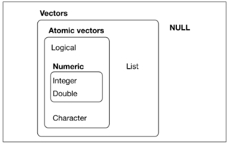
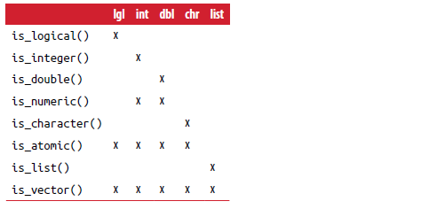

```{r setup, include=FALSE}
knitr::opts_chunk$set(echo = FALSE)
```

```{r, include=FALSE}
library(tidyverse)
library(purrr)
getwd()
```

# Outline

-   

    1.  R Data type review

-   

    2.  Summary of control structure

-   

    3.  Create a function

-   

    4.  Generic function

-   

    5.  For Loops Versus Functionals

-   

    6.  Write effective code

# 1.1 Overall review

-   Atomic vectors (logical, integer, double, character, complex, and raw)

-   Lists, which are sometimes called recursive vectors because lists can contain other lists.

-   A list is a collection of atomic vectors or other lists (data frame are special lists in which each atomic vector has the same length)

    

```{r , eval=TRUE, echo=TRUE}
a <- c(1L, 2L) # In R, numbers are doubles by default
b <- c(1, 2, 4)
c <- c("aa", "bb", "cc")
d <- a >= 3 # Logical vectors are usually constructed with comparison operators
typeof(a)
#typeof(b)
#typeof(c)
#typeof(d)
l <- list(a, b, c, d, list(2,3))
typeof(l)
length(a) #length of vector
length(l)
```

-   Sometimes you want to do different things based on the type of vector.

```{r , eval=TRUE, echo=TRUE}
t1 <- is_list(l)
t1
t2 <- is_integer(b)
t2
```

It's safer to use the is\_\* functions provided by purrr, which are summarized in the following table.



# 1.2 Subsetting of vector

-   There are three types of things that you can subset a vector with:

1.  A numeric vector containing only integers. The integers must either be all positive, all negative, or zero. Subsetting with positive integers keeps the elements at those positions:

```{r ,eval=TRUE, echo=TRUE}
t1 <- letters[c(1,2,3)]
t1
t2 <- letters[c(-1,-2,-3)]
t2
```

2.  Subsetting with a logical vector keeps all values corresponding to a TRUE value. This is most often useful in conjunction with the comparison functions:

```{r , eval=TRUE, echo=TRUE}
x <- c(10, 3, NA, 5, 8, 1, NA)
x[!is.na(x)]
x[x %% 2 == 0 & !is.na(x)]
```

3.  If you have a named vector, you can subset it with a character vector:

```{r , eval=TRUE, echo=TRUE}
x <- c(abc = 1, def = 2, xyz = 5)
x[c("xyz", "def")]
```

-   Subsetting of list Before taking a list element, we should know what we are extracting. A very useful tool for working with lists is str() because it focuses on the structure, not the contents:

```{r , eval=TRUE, echo=TRUE}
z <- list(list(1, 2), list(3, 4))
str(z)
```

There are three ways to subset a list, which I'll illustrate with a:

```{r , eval=TRUE, echo=TRUE}
a <- list(a = 1:3, b = "a string", c = pi, d = list(-1, -5))
```

1.  [ extracts a sublist. The result will always be a list:

```{r , eval=TRUE, echo=TRUE}
str(a[1:2])
```

2.  [[ extracts a single component from a list. It removes a level of hierarchy from the list:

```{r , eval=TRUE, echo=TRUE}
str(a[[1]])
str(a[["a"]])
```

3.  \$ is a shorthand for extracting named elements of a list. It works similarly to [[ except that you don't need to use quotes:

```{r , eval=TRUE, echo=TRUE}
str(a$a)
```

# 2.1 For Loops

Imagine we have this simple tibble:

```{r , eval=TRUE, echo=TRUE}
df <- tibble(
a = rnorm(10),
b = rnorm(10),
c = rnorm(10),
d = rnorm(10)
)
```

We want to compute the median of each column. You could do it with copy-and-paste:

```{r , eval=TRUE, echo=TRUE}
median(df$a)
median(df$b)
median(df$c)
median(df$d)
```

But that breaks our rule of thumb: never copy and paste more than **twice**. Instead, we could use a for loop:

```{r , eval=TRUE, echo=TRUE}
output <- vector("double", ncol(df)) # 1. output
for (i in seq_along(df)) {           # 2. sequence
  output[[i]] <- median(df[[i]])       # 3. body
}
output
```

Every for loop has three components:

1.  output \<- vector("double", length(x))

Before you start the loop, you must always allocate sufficient space for the output. This is very important for efficiency: if you grow the for loop at each iteration using c() (for example), your for loop will be very slow. A general way of creating an empty vector of given length is the vector() function. It has two arguments: the type of the vector ("logical," "integer," "double," "character," etc.) and the length of the vector.

2.  sequence i in seq_along(df)

This determines what to loop over: each run of the for loop will assign i to a different value from seq_along(df). It's useful to think of i as a pronoun, like "it." You might not have seen seq_along() before. It's a safe version of the familiar 1:length(l), with an important difference; if you have a zero-length vector, seq_along() does the right thing:

```{r , eval=TRUE, echo=TRUE}
y <- vector("double", 0)
seq_along(y)
y <- vector("double", 4)
seq_along(y)
```

```{r , eval=TRUE, echo=TRUE}
1:length(y)
```

3.  body output[[i]] \<- median(df[[i]])

This is the code that does the work. It's run repeatedly, each time with a different value for i. The first iteration will run output[[1]] \<- median(df[[1]]), the second will run output[[2]] \<- median(df[[2]]), and so on.

# 2.2 For Loops Variations

There are four variations on the basic theme of the for loop: • Modifying an existing object, instead of creating a new object. • Looping over names or values, instead of indices. • Handling outputs of unknown length. • Handling sequences of unknown length.

# 2.2.1 Modifying an Existing Object

```{r , eval=TRUE, echo=TRUE}
for (i in seq_along(df)) {
df[[i]] <- df[[i]]+5
}
df
```

# 2.2.2 Looping Patterns

There are three basic ways to loop over a vector. So far I've shown you the most general: looping over the numeric indices with for (i in seq_along(xs)), and extracting the value with x[[i]].

Loop over the elements: for (x in xs). This is most useful if you only care about side effects, like plotting or saving a file, because it's difficult to save the output efficiently.

Loop over the names: for (nm in names(xs)). This gives you a name, which you can use to access the value with x[[nm]]. This is useful if you want to use the name in a plot title or a filename.

```{r , eval=TRUE, echo=TRUE}
output <- vector("double", ncol(df)) # 1. output
names(output) <- names(df)
for (nm in names(df)) {           # 2. sequence
  output[[nm]] <- median(df[[nm]])       # 3. body
}
output
```

# 2.2.3 Unknown Output Length

```{r , eval=TRUE, echo=TRUE}
means <- c(0, 1, 2, 4, 5, 6)
output <- double()
for (i in seq_along(means)) {
  n <- sample(10000000, 1) #rand
  output <- c(output, rnorm(n, means[[i]]))
}
```

```{r , eval=F, echo=TRUE}
out <- vector("list", length(means))

for (i in seq_along(means)) {
  n <- sample(10000000, 1)
  out[[i]] <- rnorm(n, means[[i]])
}
unlist(out)

```

# 2.2.4 Unknown Sequence Length

Sometimes you don't even know how long the input sequence should be. This is common when doing simulations. For example, you might want to loop until you get three heads in a row. You can't do that sort of iteration with the for loop. Instead, you can use a while loop. A while loop is simpler than a for loop because it only has two components, a condition and a body: while (condition) { \# body } A while loop is also more general than a for loop, because you can rewrite any for loop as a while loop, but you can't rewrite every while loop as a for loop: for (i in seq_along(x)) { \# body } \# Equivalent to i \<- 1 while (i \<= length(x)) { \# body i \<- i + 1 }

Here's how we could use a while loop to find how many tries it takes to get three heads in a row:

```{r , eval=TRUE, echo=TRUE}
flip <- function() sample(c("T", "H"), 1)
flips <- 0
nheads <- 0
while (nheads < 3) {
  if (flip() == "H") {
    nheads <- nheads + 1
  } else {
  nheads <- 0
  }
  flips <- flips + 1
}
flips
```

# 2.3 if-else

The if() function allows you to conditionally execute a statement.

The syntax for the if() structure is: if(condition){ statements } else { statements }

The run condition is unary logic vector (TRUE or FALSE) with no missing (NA). The else part is optional. if there is only one statement, and the curly braces can be omitted.

```{r , eval=TRUE, echo=TRUE}
opt <- c(T)
if (opt) print("Good morning") else print("Good evening")
opt <- c(F)
if (opt) print("Good morning") else print("Good evening")
```

# 2.4 ifelse

Ifelse () is a quantized version of the function if(). Vectorization allows a function to handle objects that have no explicit loop.

The format of ifelse() is: ifelse(test, yes, no)

Where test is an object that has been forced into logical mode, yes returns the value of test when the element is true, and no returns the value of test when the element is false.

```{r , eval=TRUE, echo=TRUE}
pvalues <- c(.0867, .0018, .0054, .1572, .0183, .5386)
results <- ifelse(pvalues <.05, "Significant", "Not Significant")
results
```

# 2.5 switch

Switch selects statement execution based on the value of an expression.

Grammar: switch(expr, ...)

One of the... Represents a statement bound to the various possible output values of EXPR.

```{r , eval=TRUE, echo=TRUE}
feelings <- c("sad", "afraid", "aa")
for (i in feelings)
  print(
    switch(i,
      happy = "I am glad you are happy",
      afraid = "There is nothing to fear",
      sad = "Cheer up",
      angry = "Calm down now",
      "ERROR"
    )
  )
```

# 3.1 When Should You Write a Function?

```{r , eval=TRUE, echo=TRUE}
df <- tibble::tibble(
a = rnorm(10),
b = rnorm(10),
c = rnorm(10),
d = rnorm(10)
)
df$a <- (df$a - min(df$a, na.rm = TRUE)) /
(max(df$a, na.rm = TRUE) - min(df$a, na.rm = TRUE))
df$b <- (df$b - min(df$b, na.rm = TRUE)) /
(max(df$b, na.rm = TRUE) - min(df$a, na.rm = TRUE))
df$c <- (df$c - min(df$c, na.rm = TRUE)) /
(max(df$c, na.rm = TRUE) - min(df$c, na.rm = TRUE))
df$d <- (df$d - min(df$d, na.rm = TRUE)) /
(max(df$d, na.rm = TRUE) - min(df$d, na.rm = TRUE))
```

```{r , eval=TRUE, echo=TRUE}
x <- df$a
(x - min(x, na.rm = TRUE)) /(max(x, na.rm = TRUE) - min(x, na.rm = TRUE))
```

```{r , eval=TRUE, echo=TRUE}
rng <- range(x, na.rm = TRUE)
rng
(x - rng[1]) / (rng[2] - rng[1])
```

```{r , eval=TRUE, echo=TRUE}
rescale01 <- function(x) {
  rng <- range(x, na.rm = TRUE)
  (x - rng[1]) / (rng[2] - rng[1])
}
rescale01(c(0, 5, 10))
```

# 3.2 The function of grammar

functionname \<- function(parameters) {

statements

return()

}

1.  You need to pick a **name** for the function. Here I've used rescale01 because this function rescales a vector to lie between 0 and 1.

2.  You list the inputs, or **arguments**, to the function inside func tion. Here we have just one argument. If we had more the call would look like function(x, y, z).

3.  You place the code you have developed in the **body** of the function, a { block that immediately follows function(...).

# 3.3 Parameters

-   parameters If the function has more than one argument, the arguments are separated by commas. Arguments can be passed by keyword and/or position. In addition, parameters can have default values.

```{r , eval=TRUE, echo=TRUE}
f <- function(x, y, z=1){
result <- x + (2*y) + (3*z)
return(result)
}
```

```{r , eval=TRUE, echo=TRUE}
f(2,3,4)
f(2,3)
f(x=2, y=3)
f(z=4, y=2, 3)
```

In the first example, the parameters are passed by position (x=2, y=3, z=4). In the second example, the argument is also passed by position, and z defaults to 1. In the third example, the argument is passed by keyword, and z also defaults to 1. In the last example, y and z are passed by keyword, and x is assumed to be the first argument that is not explicitly specified (here x=3).

If you need to programmatically get parameter names and default values

```{r , eval=TRUE, echo=TRUE}
formals(f)
```

# 3.4 Scope of object

The scope of objects in R (how names produce content) is a complex topic. In a typical case, there are several points.

1.  Objects created outside a function are global (and also apply inside a function). Objects created within a function are local (they only apply inside the function).

2.  Local objects are discarded after the function is executed. Only those who pass the return() function (or use the operator \< \< - The object returned can continue to be used after the function is executed.

3.  Global objects are accessible (readable) within functions but do not change (unless used; \<\< - operator).

4.  Objects can be passed into a function as arguments, but they are not changed by the function. A copy of the object is passed instead of the variable itself.

```{r , eval=TRUE, echo=TRUE}
x <- 2
y <- 3
z <- 4
f <- function(w){
  z <- 2
  x <- w*y*z
  return(x)
}
a <- f(x)
a
x
y
z
```

```{r , eval=TRUE, echo=TRUE}
x <- 2
y <- 3
z <- 4
b <- vector("double",0)
ff <- function(w){
  z <- 2
  b <<- w*y*z #use the operator
  return(b)  #use the return
}
ff(x)
b
x
y
z
```

# 3.5 Object environment

```{r , eval=TRUE, echo=TRUE}
x <- 5
myenv <- new.env()
assign("x", "Homer", env=myenv)
get("x", env=myenv)
x
```

In the global environment there exists an object called X with a value of 5. An object called x also exists in myenv's environment with a value of "Homer".

The parent-env () function shows the parent environment. Continuing with the example, myenv's parent environment is the global environment:

```{r , eval=TRUE, echo=TRUE}
parent.env(myenv)
```

```{r , eval=TRUE, echo=TRUE}
trim <- function(p){
  trimit <- function(x){
    n <- length(x)
    lo <- floor(n*p) + 1
    hi <- n + 1 - lo
    x <- sort.int(x, partial = unique(c(lo, hi)))[lo:hi]
  }
  trimit
}
```

The trim(p) function returns a function that trims p% of the high and low values from a vector:

```{r , eval=TRUE, echo=TRUE}
x <- 1:10
p <- 0.1
trim10pct <- trim(p)
y <- trim10pct(x)
y
```

```{r , eval=TRUE, echo=TRUE}
p <- 0.2
y <- trim10pct(x)
y
```

This is done because the p-value is in the context of the trimit() function and is stored in the function:

```{r , eval=TRUE, echo=TRUE}
ls(environment(trim10pct))
```

```{r , eval=TRUE, echo=TRUE}
get("p", env=environment(trim10pct))
```

In general, the value of an object is obtained from the local environment. If the object is not found in the local environment, R searches the parent environment, then the parent environment, until the object is found.

# 3.6 Function example

```{r , eval=TRUE, echo=TRUE}
aestdt <- c("2022/08/08", "2008/08", "2022//02", "/08/08", "/02/", "//02", "2022//",'///')
aeendt <- c("2022/08/08", "2008/08", "2022//02", "/08/08", "/02/", "//02", "2022//",'///')
ae <- data.frame(aestdt,aeendt)
source("sourceRcode/iso8601.r")
ae$aestdtc <- pdate(indt=ae$aestdt)
ae$aestdtc
ae$aeendtc <- pdate(indt=ae$aeendt)
ae$aeendtc
```

# 4.1 Generic function

Every object has properties: meta-information that describes the properties of the object. Attributes can be listed using the Attributes () function and set using the attr() function. A key attribute is the object's class. The R function uses information about the object's class to determine what to do with the object. You can use the class() function to read and set an object's class.

```{r , eval=TRUE, echo=TRUE}
x <- c(1,2,3,4,5,6,7,8)
attributes(x)
class(x)
```

```{r , eval=TRUE, echo=TRUE}
attr(x, "dim") <- c(2,4)
x
```

```{r , eval=TRUE, echo=TRUE}
class(x)
attributes(x)
```

```{r , eval=TRUE, echo=TRUE}
attr(x, "dim") <- NULL
attributes(x)
class(x)
x
```

```{r , eval=TRUE, echo=TRUE}
attr(x, "dim") <- c(2,2,2)
x
```

```{r , eval=TRUE, echo=TRUE}
class(x)
attributes(x)
```

```{r , eval=TRUE, echo=TRUE}
head(iris)
class(iris)
attributes(iris)
```

R is an object-oriented programming language based on the use of generic functions. Each object has a class attribute that determines what code to run when a copy of the object is passed to generic functions like print() and plot() summary().

**R uses an object's class to determine what action to take when a generic function is called.**

```{r , eval=TRUE, echo=TRUE}
summary(women)
fit <- lm(weight ~ height, data=women)
summary(fit)
```

In the first example, the summary() function gives a descriptive analysis of each variable in the Women box. In the second example, the summary() function describes a linear regression model for the data box. How did this happen?

```{r , eval=TRUE, echo=TRUE}
summary
```

```{r , eval=TRUE, echo=TRUE}
methods(summary)
```

```{r , eval=TRUE, echo=TRUE}
class(women)
```

```{r , eval=TRUE, echo=TRUE}
class(fit)
```

**The function dispatches an object to a generic function, provided that the generic function has an extension that matches the object's class.**

You can use the functions used in the previous examples and see the code for these functions by removing the parentheses (**summary.data.frame**, summary.lm, and summary.default). Invisible functions (functions that asterisk the list of methods) cannot view the code this way. In these cases, you can use the getAnywhere() function to view the code. To see the code for summary.ecdf(), type **getAnywhere(summary.ecdf)**. **Looking at existing code is a great way to get ideas for your own functions.**

```{r , eval=TRUE, echo=TRUE}
mymethod <- function(x, ...) UseMethod("mymethod")
mymethod.a <- function(x) print("Using A")
mymethod.b <- function(x) print("Using B")
mymethod.default <- function(x) print("Using Default")
```

```{r , eval=TRUE, echo=TRUE}
x <- 1:5
y <- 6:10
z <- 10:15
class(x) <- "a"
mymethod(x)
```

```{r , eval=TRUE, echo=TRUE}
class(y) <- "b"
mymethod(y)
```

```{r , eval=TRUE, echo=TRUE}
class(z) <- c("a", "b")
mymethod(z)
```

```{r , eval=TRUE, echo=TRUE}
class(z) <- c("c", "a", "b")
mymethod(z)
```

```{r , eval=TRUE, echo=TRUE}
class(women) <- "lm"
#summary(women)
```

# 5.1 For Loops Versus Functionals

For loops are not as important in R as they are in other languages because R is a functional programming language.

```{r , eval=F, echo=TRUE}
df <- tibble(
a = rnorm(10),
b = rnorm(10),
c = rnorm(10),
d = rnorm(10)
)
output <- vector("double", length(df))
for (i in seq_along(df)) {
output[[i]] <- mean(df[[i]])
}
output

col_mean <- function(df) {
  output <- vector("double", length(df))
  for (i in seq_along(df)) {
    output[i] <- mean(df[[i]])
  }
  output
}
col_mean(df)
```

But then you think it'd also be helpful to be able to compute the median, and the standard deviation

```{r , eval=TRUE, echo=TRUE}
col_summary <- function(df, fun) {
  out <- vector("double", length(df))
  for (i in seq_along(df)) {
    out[i] <- fun(df[[i]])
  }
  out
}
col_summary(df, median)
col_summary(df, sd)
```

The idea of passing a function to another function is an extremely powerful idea, and it's one of the behaviors that makes R a functional programming language.

The pattern of looping over a vector, doing something to each element, and saving the results is so common that the purrr package provides a family of functions to do it for you. There is one function for each type of output:

• map() makes a list.

• map_lgl() makes a logical vector.

• map_int() makes an integer vector.

• map_dbl() makes a double vector.

• map_chr() makes a character vector.

```{r , eval=TRUE, echo=TRUE}
map_dbl(df, median)
```

# 6 Write effective code

Several coding techniques can make your programs more efficient.

1.  Program reads only the data it needs.

2.  Use vectorization instead of cycles whenever possible.

3.  Create objects of the correct size, rather than resize them repeatedly.

# 6.1 Program reads only the data it needs

```{r , eval=TRUE, echo=TRUE}
#my.data.frame <- read.table(mytextfile, header=TRUE, sep=',', colClasses=c("numeric", "numeric", "character", NULL, "numeric", NULL, "character", NULL, NULL, NULL))

#my.data.frame <- read.table(mytextfile, header=TRUE, sep=',')
```

# 6.2 Vector quantization

```{r , eval=TRUE, echo=TRUE}
set.seed(1234)
mymatrix <- matrix(rnorm(10000000), ncol=10)

accum <- function(x){
  sums <- numeric(ncol(x))
  for (i in 1:ncol(x)){
    for(j in 1:nrow(x)){
      sums[i] <- sums[i] + x[j,i]
    }
  }
  return(sums)
}
a <- accum(mymatrix)
a
system.time(accum(mymatrix))
```

```{r , eval=TRUE, echo=TRUE}
b <- colSums(mymatrix)
b
system.time(colSums(mymatrix))
```

# 6.3 An object of the correct size

```{r , eval=TRUE, echo=TRUE}
set.seed(1234)
k <- 100000
x <- rnorm(k)
```

```{r , eval=TRUE, echo=TRUE}
y <- 0
system.time(for (i in 1:length(x)) y[i] <- x[i]^2)
```

```{r , eval=TRUE, echo=TRUE}
y <- numeric(length=k)
system.time(for (i in 1:k) y[i] <- x[i]^2)
```

# 6.4 Other tips

1.  Generally, function names should be **verbs**, and arguments should be **nouns**.

2.  If your function name is composed of multiple words, I recommend using "**snake_case**," where each lowercase word is separated by an **underscore**.

3.  If you have a family of functions that do similar things, make sure they have **consistent** names and arguments.

4.  Where possible, **avoid** overriding existing functions and variables.

5.  Use comments, lines starting with **\#**, to explain the "why" of your code. Another important use of comments is to break up your file into easily readable chunks. RStudio provides a keyboard shortcut to create these headers (Cmd/Ctrl-Shift-R),
