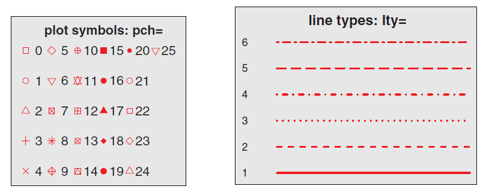
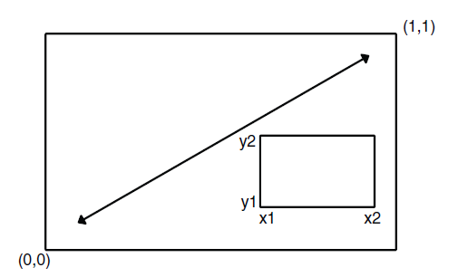
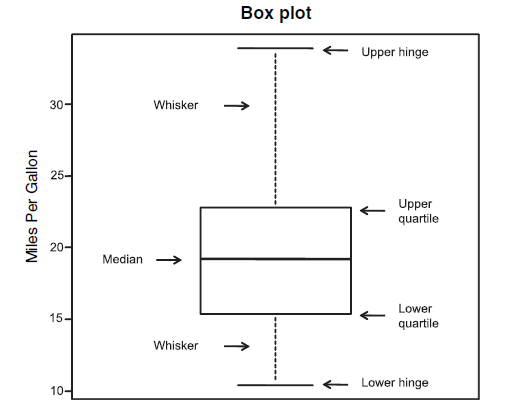

```{r setup, include=FALSE}
knitr::opts_chunk$set(echo = TRUE)
```

# Outline

-   Introduction to R graphs

-   Working with graphs

-   Graphical parameters

-   Bar, box, and dot plots

-   Pie and fan charts

-   Histograms and kernel density plots

# Introduction to R graphs

### four graphic systems in R

1.  base graphics

2.  lattice package

3.  ggplot2 package

4.  grid package

# functions in graphics

```{r functions in graphics}
head(ls("package:graphics"),30)
```

```{r help,eval=FALSE}
help(package="graphics")
```

# base graphics

-   high-level plotting function

-   low-level plotting commands

-   Graphical parameters

# Working with graphs

### plot() - Scatter plot

```{r Scatter plot}
head(women)
layout(matrix(c(1,2,3), 1, 3))
plot(women$height)
plot(women$height,women$weight)
plot(women$height,women$weight,type="l",lty=1)
```

-   type: "p" for points, "l" for lines, "b" for both points and lines, "c" for empty points joined by lines, "o" for overplotted points and lines, "s" and "S" for stair steps and "h" for histogram-like vertical lines, "n" does not produce any points or lines.

-   Plotting symbols specified with the pch&lty parameter {width="70%"}

-   cex: Specifies the symbol size. cex is a number indicating the amount by which plotting symbols should be scaled relative to the default. 1 = default, 1.5 is 50% larger, 0.5 is 50% smaller, and so forth.

-   lwd: Specifies the line width. lwd is expressed relative to the default (1 = default). For example, lwd=2 generates a line twice as wide as the default.

# plot() - Bar Plot

```{r Bar Plot}
head(mtcars)
par(fig=c(0, 0.49, 0, 0.8))
plot(mtcars$cyl)
par(fig=c(0.5, 1, 0, 0.8),new=TRUE)
plot(as.factor(mtcars$cyl))
```

# plot() - Box plots

```{r Box plots}
plot(as.factor(mtcars$cyl),mtcars$mpg)
```

# plot() - ispinogram

```{r ispinogram}
plot(as.factor(mtcars$cyl),as.factor(mtcars$am))
```

# plot() - linear regression

```{r linear regression}
fit<-lm(height~weight,data=women)
fit
par(mfrow=c(2,2))
plot(fit)
```

# Save graphs

```{r save, eval=FALSE}
pdf("mygraph.pdf")
fit<-lm(height~weight,data=women)
fit
par(mfrow=c(2,2))
plot(fit)
dev.off()
```

In addition to pdf(), you can use the functions win.metafile(), png(), jpeg(), bmp(), tiff(), xfig(), and postscript() to save graphs in other formats

# method in plot()

```{r method}
methods(plot)
```

# graphical parameters

## default arguments to par()

```{r default argument, eval=FALSE}
par()#current graphical settings
opar <- par(no.readonly=TRUE) #current graphical settings that can be modified
par("col")#current setting of "col"
```

# How to use graphical parameters

Values set in this manner will be in effect for the rest of the session or until they're changed.

```{r parameter}
par(col="red")
par(col.axis="blue")
par(lty=1,pch=24)
plot(women$height,women$weight,type="b")
```

# Colors

There are several color-related parameters in R.

+-----------+-----------------------------------------------------------------------------------------------------------------------------------------------------------------------------------------------------------------------------------------------+
| Parameter | Description                                                                                                                                                                                                                                   |
+===========+===============================================================================================================================================================================================================================================+
| col       | Default plotting color. Some functions (such as lines and pie) accept a vector of values that are recycled. For example, if col=c("red", "blue") and three lines are plotted, the first line will be red, the second blue, and the third red. |
+-----------+-----------------------------------------------------------------------------------------------------------------------------------------------------------------------------------------------------------------------------------------------+
| col.axis  | Color for axis text.                                                                                                                                                                                                                          |
+-----------+-----------------------------------------------------------------------------------------------------------------------------------------------------------------------------------------------------------------------------------------------+
| col.lab   | Color for axis labels.                                                                                                                                                                                                                        |
+-----------+-----------------------------------------------------------------------------------------------------------------------------------------------------------------------------------------------------------------------------------------------+
| col.main  | Color for titles.                                                                                                                                                                                                                             |
+-----------+-----------------------------------------------------------------------------------------------------------------------------------------------------------------------------------------------------------------------------------------------+
| col.sub   | Color for subtitles.                                                                                                                                                                                                                          |
+-----------+-----------------------------------------------------------------------------------------------------------------------------------------------------------------------------------------------------------------------------------------------+
| fg        | Color for the plot's foreground.                                                                                                                                                                                                              |
+-----------+-----------------------------------------------------------------------------------------------------------------------------------------------------------------------------------------------------------------------------------------------+
| bg        | Color for the plot's background.                                                                                                                                                                                                              |
+-----------+-----------------------------------------------------------------------------------------------------------------------------------------------------------------------------------------------------------------------------------------------+

You can specify colors in R by index, name, hexadecimal, RGB, or HSV. For example, **col=1, col="white", col="#FFFFFF", col=rgb(1,1,1), and col=hsv(0,0,1)** are equivalent ways of specifying the color white. The function rgb() creates colors based on red-green-blue values, whereas hsv() creates colors based on hue-saturation values.

colors(): returns all available color names.

# Text characteristics

-   Parameters specifying text size

    +------------+-------------------------------------------------------------------------------------------------------------------------------------------------------------+
    | Parameter  | Description                                                                                                                                                 |
    +============+=============================================================================================================================================================+
    | cex        | Number indicating the amount by which plotted text should be scaled relative to the default. 1 = default, 1.5 is 50% larger, 0.5 is 50% smaller, and so on. |
    +------------+-------------------------------------------------------------------------------------------------------------------------------------------------------------+
    | cex.axis   | Magnification of axis text relative to cex.                                                                                                                 |
    +------------+-------------------------------------------------------------------------------------------------------------------------------------------------------------+
    | cex.lab    | Magnification of axis labels relative to cex.                                                                                                               |
    +------------+-------------------------------------------------------------------------------------------------------------------------------------------------------------+
    | cex.main   | Magnification of titles relative to cex.                                                                                                                    |
    +------------+-------------------------------------------------------------------------------------------------------------------------------------------------------------+
    | cex.sub    | Magnification of subtitles relative to cex.                                                                                                                 |
    +------------+-------------------------------------------------------------------------------------------------------------------------------------------------------------+

-   Parameters specifying font family, size, and style

    +------------+-------------------------------------------------------------------------------------------------------------------------------------------------------------+
    | Parameter  | Description                                                                                                                                                 |
    +============+=============================================================================================================================================================+
    | font       | Integer specifying the font to use for plotted text. 1 = plain, **2 = bold**, *3 = italic*, ***4 = bold*** italic, and 5=symbol (in Adobe symbol encoding). |
    +------------+-------------------------------------------------------------------------------------------------------------------------------------------------------------+
    | font.axis  | Font for axis text.                                                                                                                                         |
    +------------+-------------------------------------------------------------------------------------------------------------------------------------------------------------+
    | font.lab   | Font for axis labels.                                                                                                                                       |
    +------------+-------------------------------------------------------------------------------------------------------------------------------------------------------------+
    | font.main  | Font for titles.                                                                                                                                            |
    +------------+-------------------------------------------------------------------------------------------------------------------------------------------------------------+
    | font.sub   | Font for subtitles.                                                                                                                                         |
    +------------+-------------------------------------------------------------------------------------------------------------------------------------------------------------+
    | ps         | Font point size (roughly 1/72 inch). The text size = ps\*cex.                                                                                               |
    +------------+-------------------------------------------------------------------------------------------------------------------------------------------------------------+
    | family     | Font family for drawing text. Standard values are serif, sans, and mono.                                                                                    |
    +------------+-------------------------------------------------------------------------------------------------------------------------------------------------------------+

```{r font in windows, eval=FALSE, include=FALSE}
windowsFonts(
A=windowsFont("Arial Black"),
B=windowsFont("Bookman Old Style"),
C=windowsFont("Comic Sans MS")
)
```

# Graph and margin dimensions

+-----------+---------------------------------------------------------------------------------------------------------------------------------------+
| Parameter | Description                                                                                                                           |
+===========+=======================================================================================================================================+
| pin       | Plot dimensions (width, height) in inches.                                                                                            |
+-----------+---------------------------------------------------------------------------------------------------------------------------------------+
| mai       | Numerical vector indicating margin size, where c(bottom, left, top,right) is expressed in inches.                                     |
+-----------+---------------------------------------------------------------------------------------------------------------------------------------+
| mar       | Numerical vector indicating margin size, where c(bottom, left, top, right) is expressed in lines. The default is c(5, 4, 4, 2) + 0.1. |
+-----------+---------------------------------------------------------------------------------------------------------------------------------------+

# Adding text, customized axes, and legends

-   Titles: Use the title() function to add a title and axis labels to a plot.The format is title(main="main title", sub="subtitle", xlab="x-axis label", ylab="y-axis label")

-   Axes: Rather than use R's default axes, you can create custom axes with the axis() function.The format is axis(side, at=, labels=, pos=, lty=, col=, las=, tck=, ...)

-   Reference lines: The abline() function is used to add reference lines to a graph. The format is abline(h=yvalues, v=xvalues)

-   Legend: When more than one set of data or group is incorporated into a graph, a legend can help you to identify what's being represented by each bar, pie slice, or line. A legend can be added (not surprisingly) with the legend() function. The format is legend(location, title, legend, ...)

-   Text annotations: Text can be added to graphs using the text() and mtext() functions. text() places text within the graph, whereas mtext() places text in one of the four margins. The formats are text(location, "text to place", pos, ...), mtext("text to place", side, line=n, ...)

# A simple example

```{r example}
x <- c(1:10)
y <- x
z <- 10/x
par(mar=c(5, 4, 4, 8) + 0.1)
plot(x, y, type="b",pch=21, col="red",yaxt="n", lty=3, ann=FALSE)
lines(x, z, type="b", pch=22, col="blue", lty=2)
axis(2, at=x, labels=x, col.axis="red", las=2)
axis(4, at=z, labels=round(z, digits=2),col.axis="blue", las=2, cex.axis=0.7, tck=-.01)
mtext("y=1/x", side=4, line=3, cex.lab=1, las=2, col="blue")
title("An Example of Creative Axes",
xlab="X values",
ylab="Y=X")
abline(h=5,lty=2, col="green")
legend("top", inset=0.05, title="legend", c("A","B"),lty=c(3, 2), pch=c(21, 22), col=c("red", "blue"),cex=0.8)

```

-   Math annotations: plotmath() can add mathematical symbols and formulas to a graph using TeX-like rules.

# Combining graphs

### 1.mfrow/mfcol

-   mfrow=c(nrows, ncols): create a matrix of nrows × ncols plots that are filled in by row.

-   mfcol=c(nrows, ncols): fill the matrix by columns.

```{r Combining graphs}
attach(mtcars)
opar <- par(no.readonly=TRUE)
par(mfrow=c(2,2))
plot(wt,mpg, main="Scatterplot of wt vs. mpg")
plot(wt,disp, main="Scatterplot of wt vs. disp")
hist(wt, main="Histogram of wt")
boxplot(wt, main="Boxplot of wt")
par(opar)
detach(mtcars)
```

# 2.layout

-   The layout() function has the form layout(mat), where mat is a matrix object specifying the location of the multiple plots to combine.

```{r layout}
attach(mtcars)
layout(matrix(c(1,1,2,3), 2, 2, byrow = TRUE))
hist(wt)
hist(mpg)
hist(disp)
detach(mtcars)
```

Optionally, you can include widths= and heights= options in the layout() function to control the size of each figure more precisely. These options have the following form:

-   widths---A vector of values for the widths of columns

-   heights---A vector of values for the heights of rows

# 3.Fig

```{r fig}
opar <- par(no.readonly=TRUE)
par(fig=c(0, 0.8, 0, 0.8))
plot(mtcars$wt, mtcars$mpg,xlab="Miles Per Gallon",ylab="Car Weight")
par(fig=c(0, 0.8, 0.55, 1), new=TRUE)
boxplot(mtcars$wt, horizontal=TRUE, axes=FALSE)
par(fig=c(0.65, 1, 0, 0.8), new=TRUE)
boxplot(mtcars$mpg, axes=FALSE)
mtext("Enhanced Scatterplot", side=3, outer=TRUE,line=-2)
par(opar)
```

{width="409"}

# Basic graphs

### Bar plots

A bar plot displays the distribution (frequency) of a categorical variable through vertical or horizontal bars. In its simplest form, the format of the barplot() function is

**barplot(*height*)**

where ***height*** is a vector or matrix.

# Simple bar plots

```{r bar, message=FALSE, warning=FALSE}
library(vcd)
class(Arthritis$Improved)
counts<-table(Arthritis$Improved)
par(fig=c(0, 0.45, 0, 0.8))
barplot(counts,
main="Simple Bar Plot",
xlab="Improvement", ylab="Frequency") #Simple bar plot
par(fig=c(0.5, 1, 0, 0.8), new=TRUE)
barplot(counts,
main="Horizontal Bar Plot",
xlab="Frequency", ylab="Improvement",
horiz=TRUE) #Horizontal bar plot
```

Creating bar plots with factor variables: If the categorical variable to be plotted is a factor or ordered factor, you can create a vertical bar plot quickly with the **plot()** function. Because Arthritis\$Improved is a factor.

# Stacked and grouped bar plots

If height is a matrix rather than a vector, the resulting graph will be a stacked or grouped bar plot.

```{r Stacked and grouped bar plots}
library(vcd)
counts <- table(Arthritis$Improved, Arthritis$Treatment)
counts
par(fig=c(0, 0.45, 0, 0.8))
barplot(counts,
main="Stacked Bar Plot",
xlab="Treatment", ylab="Frequency",
col=c("red", "yellow","green"),
legend=rownames(counts))
par(fig=c(0.5, 1, 0, 0.8), new=TRUE)
par(mar=c(5, 4, 5, 2) + 0.1,cex=0.8)
barplot(counts,
main="Grouped Bar Plot",
xlab="Treatment", ylab="Frequency",
col=c("red", "yellow", "green"), beside=TRUE)
legend("top",rownames(counts),col=c("red", "yellow", "green"),pch=15,xpd=TRUE,inset=-0.13,cex=0.8)
```

The par() function allows you to make extensive modifications to the graphs that R produces by default.

# Pie charts

Pie charts are created with the function:

**pie(x, labels)**

where **x is a non-negative numeric vector** indicating the area of each slice and **labels provides a character vector** of slice labels.

```{r pie}
layout(matrix(c(1,2,3), 1, 3))
slices <- c(10, 12,4, 16, 8)
lbls <- c("US", "UK", "Australia", "Germany", "France")
pie(slices, labels = lbls,
main="Simple Pie Chart")
pct <- round(slices/sum(slices)*100)
lbls2 <- paste(lbls, " ", pct, "%", sep="")
pie(slices, labels=lbls2, col=rainbow(length(lbls2)),
main="Pie Chart with Percentages")
mytable <- table(state.region)
mytable
lbls3 <- paste(names(mytable), "\n", mytable, sep="")
pie(mytable, labels = lbls3,
main="Pie Chart from a Table\n (with sample sizes)")
```

plotrix package: fan plot, pie chart.

# Histograms

Histograms display the distribution of a continuous variable by dividing the range of scores into a specified number of bins on the x-axis and displaying the frequency of scores in each bin on the y-axis. You can create histograms with the function:

**hist(x)**

where **x is a numeric vector** of values.

```{r hist}
par(mfrow=c(2,2))
hist(mtcars$mpg)
hist(mtcars$mpg,
breaks=12,
col="red",
xlab="Miles Per Gallon",
main="Colored histogram with 12 bins")
hist(mtcars$mpg,
freq=FALSE,
breaks=12,
col="red",
xlab="Miles Per Gallon",
main="Histogram, rug plot, density curve")
rug(jitter(mtcars$mpg,amount=0.01))
lines(density(mtcars$mpg), col="blue", lwd=2)
x <- mtcars$mpg
h<-hist(x,
breaks=12,
col="red",
xlab="Miles Per Gallon",
main="Histogram with normal curve and box")
xfit<-seq(min(x), max(x), length=40)
yfit<-dnorm(xfit, mean=mean(x), sd=sd(x))
yfit <- yfit*diff(h$mids[1:2])*length(x)
lines(xfit, yfit, col="blue", lwd=2)
box()
```

# Kernel density plots

Kernel density estimation is a nonparametric method for estimating the probability density function of a random variable.The format for a density plot (that's not being superimposed on another graph) is

**plot(density(x))**

where **x is a numeric vector**.

```{r density}
par(mfrow=c(2,1))
d <- density(mtcars$mpg)
plot(d)
d <- density(mtcars$mpg)
plot(d, main="Kernel Density of Miles Per Gallon")
polygon(d, col="red", border="blue")
rug(mtcars$mpg, col="brown")
```

The sm.density.compare() function in the sm package allows you to superimpose the kernel density plots of two or more groups. The format is

**sm.density.compare(x, factor)**

where **x is a numeric vector** and **factor is a grouping variable**.

# Box plots

Box plots can be created for individual variables or for variables by group. The format is

**boxplot(formula, data=dataframe)**

where **formula is a formula** and **dataframe denotes the data frame (or list) providing the data**.

-   y \~ A, where a separate box plot for numeric variable y is generated for each value of categorical variable A.

-   y \~ A\*B, would produce a box plot of numeric variable y, for each combination of levels in categorical variables A and B.

{width="305"}

# Using parallel box plots to compare groups

```{r boxplot1, warning=FALSE}
par(fig=c(0, 0.45, 0, 0.8))
boxplot(mpg ~ cyl, data=mtcars,
main="Car Mileage Data",
xlab="Number of Cylinders",
ylab="Miles Per Gallon")
par(fig=c(0.5, 1, 0, 0.8), new=TRUE)
boxplot(mpg ~ cyl, data=mtcars,
notch=TRUE,
varwidth=TRUE,
col="red",
main="Car Mileage Data",
xlab="Number of Cylinders",
ylab="Miles Per Gallon")
```

# Box plots for two crossed factors

```{r boxplot2}
mtcars$cyl.f <- factor(mtcars$cyl,
levels=c(4,6,8),
labels=c("4","6","8"))
mtcars$am.f <- factor(mtcars$am,
levels=c(0,1),
labels=c("auto", "standard"))
boxplot(mpg ~ am.f *cyl.f,
data=mtcars,
varwidth=TRUE,
col=c("gold","darkgreen"),
main="MPG Distribution by Auto Type",
xlab="Auto Type", ylab="Miles Per Gallon")
```

# Violin plots

The format for the vioplot() function is

**vioplot(x1, x2, ... , names=, col=)**

where **x1, x2, ... represent one or more numeric vectors** to be plotted (one violin plot is produced for each vector). **The names parameter provides a character vector of labels** for the violin plots, and **col is a vector specifying the colors** for each violin plot.

```{r vioplot, message=FALSE, warning=FALSE}
library(vioplot)
x1 <- mtcars$mpg[mtcars$cyl==4]
x2 <- mtcars$mpg[mtcars$cyl==6]
x3 <- mtcars$mpg[mtcars$cyl==8]
vioplot(x1, x2, x3,
names=c("4 cyl", "6 cyl", "8 cyl"),
col="gold")
title("Violin Plots of Miles Per Gallon", ylab="Miles Per Gallon",
xlab="Number of Cylinders")
```

# Dot plots

Dot plots provide a method of plotting a large number of labeled values on a simple horizontal scale. You create them with the dotchart() function, using the format

**dotchart(x, labels=)**

where **x is a numeric vector** and **labels specifies a vector that labels** each point.

### Simple dot plot

```{r dotplot}
dotchart(mtcars$mpg, labels=row.names(mtcars), cex=.7,
main="Gas Mileage for Car Models",
xlab="Miles Per Gallon")
```

# Dot plot grouped, sorted, and colored

```{r dotplot2}
x <- mtcars[order(mtcars$mpg),]
x$cyl <- factor(x$cyl)
x$color[x$cyl==4] <- "red"
x$color[x$cyl==6] <- "blue"
x$color[x$cyl==8] <- "darkgreen"
dotchart(x$mpg,
labels = row.names(x),
cex=.7,
groups = x$cyl,
gcolor = "black",
color = x$color,
pch=19,
main = "Gas Mileage for Car Models\ngrouped by cylinder",
xlab = "Miles Per Gallon")
```

# More graphics in R ······

The R Graph Gallery: A collection of charts made with the R programming language.

<http://r-graph-gallery.com/>
